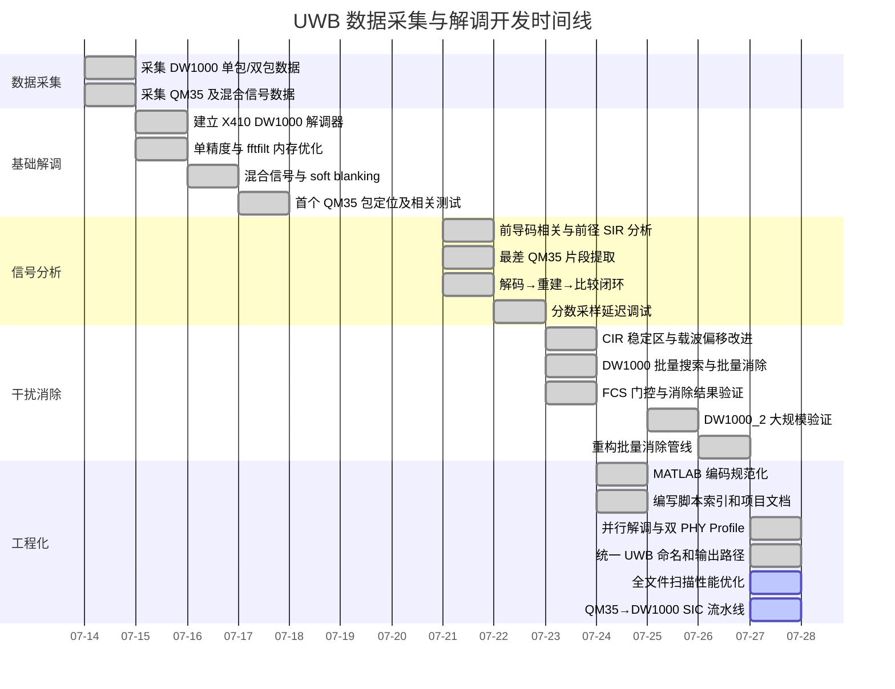
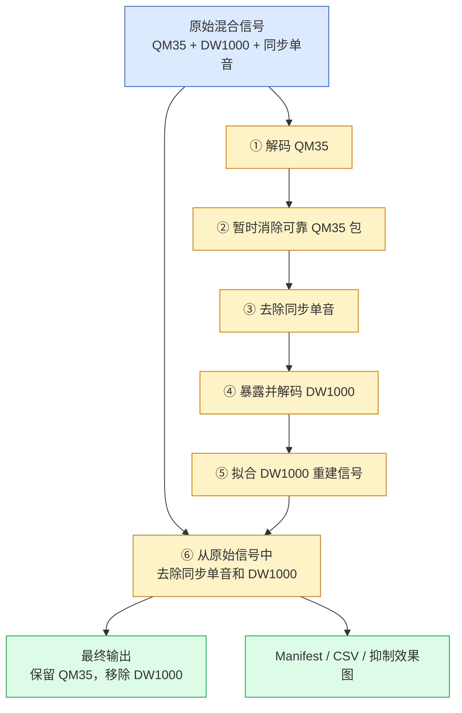
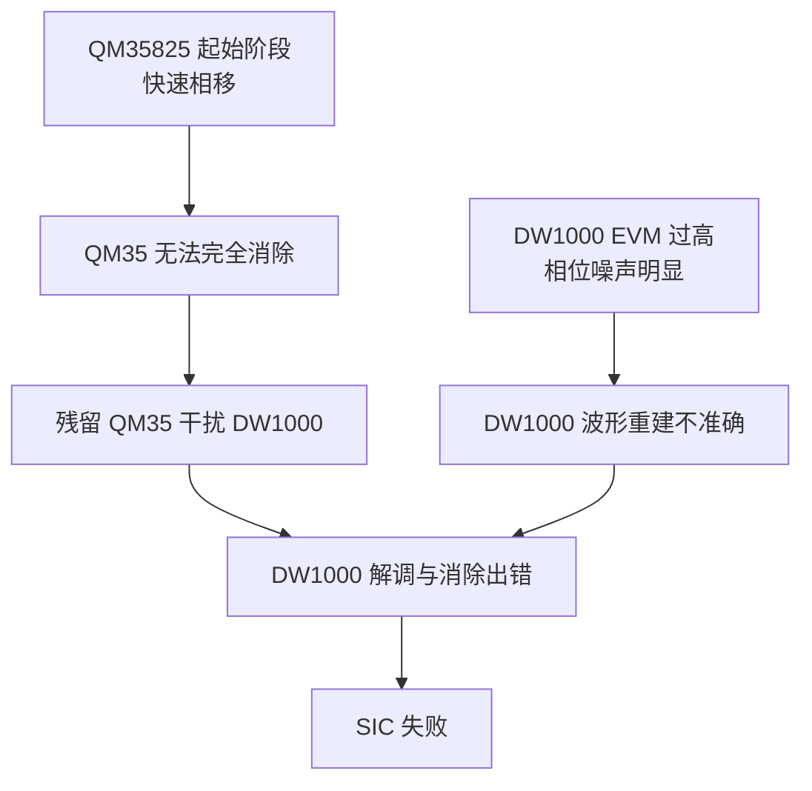

# UWB 数据采集与解调开发记录

时间范围：2026-07-14 ～ 2026-07-27

## 开发时间线

## 技术演进路线

## 当前 SIC 流水线

## 每日记录索引

| 日期       | 主要工作                        | 状态  |     |
| -------- | --------------------------- | --- | --- |
| 07-14    | 采集 12 个原始 IQ 文件，共约 30.86 GB | ✅   |     |
| 07-15    | 第一版解调器、单精度和滤波优化             | ✅   |     |
| 07-16    | 混合信号、soft blanking、周期 CIR   | ✅   |     |
| 07-17    | 第一个 QM35 包定位、N=8 相关测试       | ✅   |     |
| 07-18～20 | 暂无明确记录                      | —   |     |
| 07-21    | SIR、N 包相关、最差片段、波形重建         | ✅   |     |
| 07-22    | 分数延迟插值调试                    | ✅   |     |
| 07-23    | 批量搜索、批量消除、FCS 验证            | ✅   |     |
| 07-24    | MATLAB 规范化、README 和脚本索引     | ✅   |     |
| 07-25    | DW1000_2 大规模解调和消除验证         | ✅   |     |
| 07-26    | 重构消除管线、跨步 IQ 读取             | ✅   |     |
| 07-27    | 并行化、统一命名、性能优化和 SIC          | 🚧  |     |

## 当前待办

- [x] 提交 7 个已修改的 Git 文件 ✅ 2026-07-27
- [ ] 将 6 个新文件加入 Git
- [ ] 验证 SIC 流水线完整运行
- [ ] 比较消除前后的 SIR、相关峰和 FCS 通过率
- [ ] 补充 7 月 18～20 日可能遗漏的实验记录

## 当前问题

### 1. DW1000 EVM 过高

DW1000 存在较大的相位噪声，需要研究发射功率和天线对 EVM 的影响。

测试方法：

- **Continuous Pulse 模式：**持续发送 UWB pulse，观察不同 pulse 之间的相位波动。
    
- **Continuous Wave 模式：**持续发送单载波，测量频率漂移和相位噪声。
    

### 2. QM35825 起始阶段快速相移

QM35825 在信号开始阶段存在快速相移，导致重建波形无法准确匹配，信号不能被完全消除。

可能原因：

- PA 开启产生瞬态变化；
    
- PLL 重新初始化或重新锁定。
    

后续可配置雷达为非睡眠模式，对比起始阶段的相位变化和消除效果。

### 3. SIC 受到影响

QM35 消除不完整会留下较强残余信号，进而导致 DW1000 的检测、解调和消除出错。

### 当前结论

SIC 的主要瓶颈是实际发射波形存在时变相位误差。下一步应优先验证：

1. DW1000 的相位噪声及其与功率、天线的关系；
    
2. QM35825 非睡眠模式能否消除起始快速相移；
    
3. 单信号能够稳定消除后，再继续验证完整 SIC。

## 🔗 关联笔记

- 项目主页：[[MobiCom27-规划]]
- 前期实验：[[7月3日测试]]
- 后续计划：[[7月28日实验计划]]
- 相位噪声：[[DW1000单音相位噪声与Cancellation影响分析]]
- 包头相位模板：[[UWB包头PLL相位分析]]
- 硬件与固件：[[DW1000干扰QM35报错分析]]、[[QM35825_功率配置指南]]
