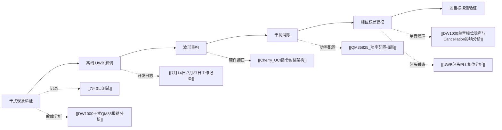

# MobiCom 2027：UWB ISAC 干扰消除

> [!summary] 项目目标
> 面向 UWB sensing 与 communication 共存场景，验证同频干扰的影响，完成离线解调、波形重构和干扰消除，并评估消除后对弱目标探测能力的改善。

## ⏳ 项目状态

| 项目 | 内容 |
| --- | --- |
| 投稿目标 | MobiCom 2027 |
| 截止日期 | 2026-09-04 |
| 当前阶段 | 离线解调与 cancellation 管线验证 |
| 主要瓶颈 | 包头确定性相位瞬态、QM35 残留干扰、跨数据集泛化 |
| 距离 DDL | `= (this.deadline - date(today)).days` 天 |

## 🧭 研究导航



### 核心研究记录

| 主题 | 笔记 | 作用 |
| --- | --- | --- |
| 项目进展 | [[7月14日-7月27日工作记录]] | 数据采集、解调、重构与 SIC 开发时间线 |
| 初始干扰实验 | [[7月3日测试]] | Channel 9/10 与不同帧长下的干扰测试 |
| 当日实验计划 | [[7月28日实验计划]] | DW1000 CW/连续帧及 QM35 睡眠模式 A/B 测试 |
| 单音相位噪声 | [[DW1000单音相位噪声与Cancellation影响分析]] | 量化相位噪声及其 cancellation 上限 |
| 包头相位瞬态 | [[UWB包头PLL相位分析]] | 验证跨 packet 可重复相位模板 |
| 同频报错 | [[DW1000干扰QM35报错分析]] | QM35 inband signal 报错根因与处理方案 |

### 工程与设备资料

| 主题 | 笔记 | 作用 |
| --- | --- | --- |
| UCI 架构 | [[Cherry_UCI指令封装架构]] | Cherry 到 QM35 固件的命令链路 |
| 功率配置 | [[QM35825_功率配置指南]] | TX Profile、校准键和功率策略 |
| 常用命令 | [[QM35825快捷指令]] | QM35825 调试命令的待维护入口 |

## 🎯 核心贡献与待验证假设

### 预期贡献

1. 揭示商用 UWB sensing 与 communication 并发时的干扰机制及其对感知的影响。
2. 构建从 IQ 采集、离线解调、波形重构到 successive interference cancellation 的完整管线。
3. 利用可重复的包头相位瞬态模板提高 cancellation suppression。
4. 量化干扰消除对弱目标探测性能的改善。

### 关键假设

- [x] QM35825 雷达波形会受到 DW1000/DW3000 同频或邻频发射影响。
- [x] MATLAB 可以解调 X410 采集的 UWB 波形。
- [x] UWB 波形可以重构并从原始信号中消除。
- [x] DW1000 与 QM35 的包头相位瞬态在设备内部具有跨 packet 一致性。
- [ ] 相位模板在跨 capture、功率、温度和 packet 间隔条件下仍然有效。
- [ ] 干扰消除能够稳定改善弱目标探测率，而不引入新的虚警。

## 🚦 Go/No-Go 决策点

| 检查点 | 判断标准 | 计划日期 | 当前状态 | 证据 / 下一步 |
| --- | --- | ---: | --- | --- |
| UWB 干扰验证 | QM35825 雷达波形受到 DW1000/DW3000 干扰 | 07-03 | ✅ 已验证 | [[7月3日测试]]、[[DW1000干扰QM35报错分析]] |
| 离线 UWB 解调 | MATLAB 可直接解调 DW1000/QM35 packet | 07-07 | ✅ 已验证 | [[7月14日-7月27日工作记录]] |
| 离线信号分离 | 可分别还原 sensing 与 communication 波形 | 07-15 | ✅ 初步完成 | 继续检查重构 EVM 与相位误差 |
| 离线干扰消除 | cancellation 后相关峰、FCS 或 SIR 改善 | 07-22 | 🚧 进行中 | 接入 [[UWB包头PLL相位分析|包头相位模板]] |
| 弱目标探测 | cancellation 后检测率提高且虚警不恶化 | 待定 | ⬜ 未验证 | 设计统一检测指标与对照实验 |

## 📅 里程碑

| 阶段 | 目标 | 状态 |
| --- | --- | --- |
| 数据与系统 | 完成多设备、多信道、多功率数据采集 | 🚧 |
| 解调与重构 | 稳定解调 QM35/DW1000 并准确重构波形 | 🚧 |
| 干扰消除 | 完成模板补偿、批量验证和消融实验 | 🚧 |
| 感知评估 | 完成弱目标检测率、虚警率和 SIR 对比 | ⬜ |
| 论文写作 | 明确贡献、整理图表并完成初稿 | ⬜ |
| 内部打磨 | 交叉复现实验、审稿式检查与最终提交 | ⬜ |

## 🧪 实验追踪

| 日期 | 实验 / 分析 | 关键结论 | 状态 |
| --- | --- | --- | --- |
| 2026-07-03 | [[7月3日测试]] | 完成 Channel 9/10 与帧长组合测试，结果尚待补录 | 🚧 |
| 2026-07-14～27 | [[7月14日-7月27日工作记录]] | 建立解调、重构、批量 cancellation 与 SIC 管线 | ✅ |
| 2026-07-28 | [[7月28日实验计划]] | 规划 DW1000 相位噪声与 QM35 睡眠模式 A/B 测试 | 📋 |
| 2026-07-29 | [[DW1000单音相位噪声与Cancellation影响分析]] | 量化 100 kHz 隆起及 cancellation 影响 | ✅ |
| 2026-07-29 | [[UWB包头PLL相位分析]] | 包头瞬态高度可重复；DW1000 模板收益更明显 | ✅ |

## ✅ 任务看板

```tasks
not done
path includes PhD-Vault/02-Project/MobiCom27-Interference
sort by due
```

```tasks
done
path includes PhD-Vault/02-Project/MobiCom27-Interference
sort by done reverse
limit 10
```

## 📝 项目记录

```dataview
TABLE WITHOUT ID
  file.link AS "笔记",
  date AS "日期",
  type AS "类型",
  summary AS "摘要",
  status AS "状态"
FROM "PhD-Vault/02-Project/MobiCom27-Interference"
WHERE file.name != this.file.name
SORT date DESC
```

## 📚 相关文献

```dataview
TABLE authors AS "作者", year AS "年份", status AS "状态"
FROM "PhD-Vault/01-Literature"
WHERE contains(projects, this.file.link)
SORT year DESC
```

## 💭 阶段性复盘

### 第一阶段：可行性与管线搭建（2026-07-03～2026-07-27）

- 已完成干扰现象验证、X410 数据采集、基础解调、波形重构和批量 cancellation。
- 当前限制从“能否解调”转为“能否处理实际硬件的时变相位误差并稳定泛化”。

### 第二阶段：相位建模与严格验证（自 2026-07-28）

- 已发现 DW1000 和 QM35 包头存在高度可重复的确定性相位瞬态。
- 下一步是将相位模板接入真实 cancellation pipeline，完成跨 capture 验证和弱目标探测评估。
