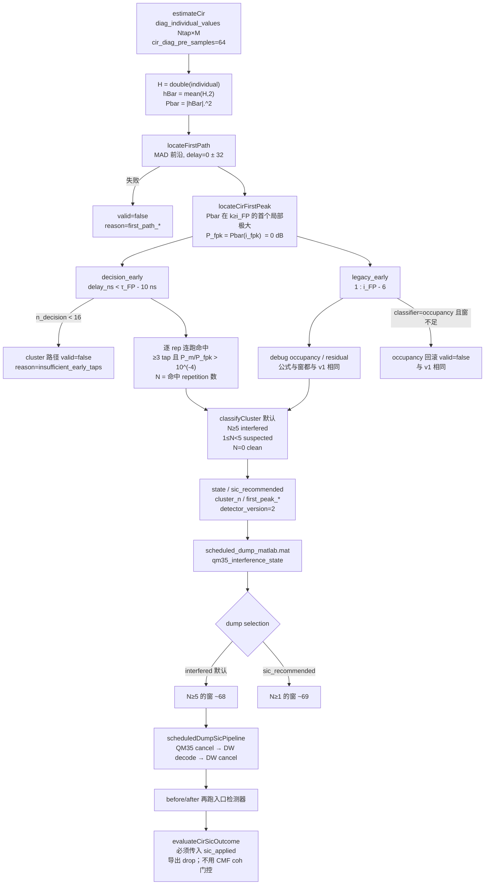

# QM35 CIR 预径簇检测器（v2）：为 dump SIC 选出更多 DW1000 重叠窗

| 字段 | 值 |
|---|---|
| Author | TBD |
| Date | 2026-08-17（Rev 4，用户拍板四条 Open Questions） |
| Status | Draft |
| Branch | `gnuradio-scheduled-dump`（不合并到 `acceleration`） |
| 取代对象 | `+uwbdecoder/analyzeCirInterference.m` 的 `classifyState`；`markdowns/QM35_CIR通信干扰检测与SIC决策方案.md` §6–7；dump SIC 选窗语义 |
| 不改动 | `decode_uwb` 主链路、`estimateCir` 估计算法、`cancel_uwb_packet_in_iq` 对齐门限、DW1000 解调 / FCS |

---

## Overview

当前 dump SIC 漏掉了大量真正被 DW1000 覆盖的 QM35 窗。根因不是消除器，而是 v1 占用率/残差检测器：当干扰覆盖**全部** CIR 用到的 SYNC repetition 时，occupancy 的“最低 25% 作背景”会自我抬升，占用率塌到 0；跨 repetition 稳定的干扰又使非相干残差 `P_res` 接近 0。在 `qm35_gain1_scheduled_sc16_dump_20260817` 的 99 个已解调包上，v1 只标出 29 个 `interfered`，而用户已验证的预径簇准则标出 68 个；那 37 个被漏掉的包 occupancy 中位数为 0.00、残差中位数 −41.3 dB，却是**最重**的全覆盖重叠。

本设计用 **First Path 定位观察窗 + 相干 CIR 第一峰作 0 dB 参考 + 逐 repetition 预径连跑命中数 N** 替换 `state` / `sic_recommended` / dump `selection='interfered'` 的分类逻辑。Occupancy 与 residual 继续在 **v1 的 `legacy_early` 窗**（`1:i_FP−6`）上计算并落盘，供对照和 `classifier='occupancy'` 回滚，但不再驱动默认决策。SIC **入口**与 **出口**拆开：N≥5 只负责“要不要尝试消除”。出口先导出相干预径峰 before/after/drop；**禁止**用 `measureCirChange` 现有的 CMF 窗 `cir_coherence ≥ 0.99` 当成功门，也禁止把 occupancy 或 N 当作清洗判据。未施加 SIC 的窗（`sic_applied=false`）两个成功标志必须为 false。

不在本设计范围内：DW1000 解不出、FCS 失败、`Fractional alignment correlation 0.691 < 0.700`（packet 47）。那些会限制最终 `sic_applied` 数量，但不是选窗器该修的问题。68 窗 SIC 之后的 16 个 FCS 失败见 [[DW1000_dump窗解调失败_假锁与窗头截断]]；该 16 窗现由 [[dump窗DW1000_跳过残段与Preamble-only_SIC]] 的 dump SIC 处理（不改簇公式）。

---

## Background & Motivation

### 现有调用链

检测器是旁路，不是解调主路径：

```text
decode_scheduled_sc16_dump
  └─ decode_uwb → result.cir
  └─ uwbdecoder.analyzeCirInterference(result.cir, opts.cir_interference_options)
        └─ 写入 results(k).qm35_* / qm35_cir_interference

run_scheduled_dump_sic_pipeline
  └─ scheduledDumpSicPipeline
        ├─ selectDumpPackets: 读 scheduled_dump_matlab.mat
        │     selection='interfered' → qm35_interference_state == "interfered"
        └─ 每窗: decode QM35 → cancel QM35 → decode DW → cancel DW(from original)
              → 再 decode QM35 → analyzeCirInterference 打 before/after
```

关键文件：

| 角色 | 路径 |
|---|---|
| v1 检测器 | [`+uwbdecoder/analyzeCirInterference.m`](F:\USRP数据解调\+uwbdecoder\analyzeCirInterference.m) |
| dump 解调接线 | [`decode_scheduled_sc16_dump.m`](F:\USRP数据解调\decode_scheduled_sc16_dump.m) L403–416 |
| dump 入口 / 选窗默认 | [`run_scheduled_dump_sic_pipeline.m`](F:\USRP数据解调\run_scheduled_dump_sic_pipeline.m) L23 |
| SIC 编排 | [`scheduledDumpSicPipeline.m`](F:\USRP数据解调\scheduledDumpSicPipeline.m) `selectDumpPackets` / `packDecodedCir` / `measureCirChange` |
| 试用簇打分（非正式） | [`analyze_dump_sic_detector_mismatch.m`](F:\USRP数据解调\analyze_dump_sic_detector_mismatch.m) 局部函数 `clusterScore` |
| 第一峰可视化（已有两份拷贝） | [`visualize_scheduled_dump_sic_cir.m`](F:\USRP数据解调\visualize_scheduled_dump_sic_cir.m) `firstPeakIndex`；[`visualize_qm35_cir_interference.m`](F:\USRP数据解调\visualize_qm35_cir_interference.m) `locateFirstPeak` |
| 被取代的分类条款 | [`markdowns/QM35_CIR通信干扰检测与SIC决策方案.md`](F:\USRP数据解调\markdowns\QM35_CIR通信干扰检测与SIC决策方案.md) §6–7 |
| 单元测试 | [`tests/testAnalyzeCirInterference.m`](F:\USRP数据解调\tests\testAnalyzeCirInterference.m) |

`packageResult.m` **不**调用检测器；`decode_uwb` 主链路保持不动。`sic_pipeline/` 不复制检测逻辑。

### v1 分类（正在使用）

`classifyState`（`analyzeCirInterference.m` L253–263）：

```matlab
if occupancy > 0.20
    state = "interfered";
elseif residualDb > -25 || peakDb > -15
    state = "suspected";
else
    state = "clean";
end
sic_recommended = (state == "interfered") || (state == "suspected");
```

Occupancy（L234–251）：每个 repetition 的 early 窗功率中位数 vs **本包最低 25% repetition 的中位数 + 5 dB**（dump 脚本把 margin 改成 3 dB）。Early 窗是 `1:(firstPathIndex - 6)`。

`run_scheduled_dump_sic_pipeline.m` 默认 `cfg.selection = 'interfered'`，因此 **只有 occupancy>0.20 的包进入消除**。

### 在 gain1 上量到的失效

数据：`decoded_results/qm35_gain1_scheduled_sc16_dump_20260817/`（99 个有效包；`gain1_prefp_cluster_criterion.csv` + SIC `qm35_cir_before_after_dw1000_metrics.csv`）。

| 检测器 | clean | suspected | interfered |
|---|---:|---:|---:|
| v1 occupancy / residual | 68 | 2（pkt 39, 85；簇准则下 N=54，实为 interfered） | 29 |
| 预径簇试用（FP−10 ns，连跑≥3 @ −40 dB，N≥5） | 30 | 1（pkt 13，N=4） | 68 |

交叉表：

| v1 \ 簇 | clean | suspected | interfered |
|---|---:|---:|---:|
| clean | 30 | 1 | **37** |
| suspected | 0 | 0 | 2 |
| interfered | 0 | 0 | 29 |

29 个 v1-`interfered` 是簇-`interfered` 的真子集。被漏掉的 37 包：

- occupancy 中位数 **0.00**（21 个恰好为 0，其余 ≤0.20）
- `R_early` 中位数 **−41.3 dB**
- 簇 N 中位数 **54**（34/37 为满覆盖 54；最小 N=6）
- 逐 rep 预径最大峰中位数 **−17.7 dB**（相对第一峰）

物理解释：这些是 **每个 SYNC 都被占住** 的最重重叠。最低 25% “背景”本身就是干扰，阈值被抬到干扰水平，occupancy 坍缩。干扰相对稳定时 `P_res = E[|H|²] − |E H|²` 也接近 0。v1 反而只对**部分覆盖**（有干净 repetition 当背景）敏感。

SIC 已跑的 29 窗：DW FCS 20，真正 `sic_applied` 19。packet 47 是 FCS 过但 `alignment_correlation 0.691 < 0.70` 被跳过——**本设计不修对齐**。19 个已消除包：

- v1 `state` 仅 6 个从 `interfered` 翻走，13 个仍 `interfered`
- occupancy 中位数 0.50 → 0.48（几乎不动）
- `R_early` 中位数 −30.9 → −43.6 dB（−12 dB，有信息但不是分类器）
- `measureCirChange` 的 `cir_coherence` 中位数 0.9987、最小 0.9757。该量在 **CMF 窗**（`cir.values`，约 `cir_pre=8` / `cir_post=30`、delay≈0）上算，**不是** diag / 预径窗。最大的 4 次视觉清洗（pkt 15/35/50/77，相干预径峰约 0→−44 dB）恰恰是 0.99 门的失败者（0.9757–0.9876）；仍标 `interfered` 的包反而 0.995–1.000，因为 CMF 向量几乎没动。因此 **不能**把 `cir_coherence ≥ 0.99` 读成“主径没被打坏”
- 簇 N 在视觉上已干净的包上仍常 ≥10：逐 rep CIR 比相干 CIR 噪 6–10 dB，N≥5 **不能**当出口

事后 overlay 里仍看到 0 dB 预径能量的，主要是这 37 个**从未进 SIC** 的包，不是消除损伤。

---

## Goals & Non-Goals

### Goals

1. 用可实现的数学替换 `classifyState`，使 dump `selection='interfered'` 在 gain1 上选出约 **68** 窗而不是 29。
2. 锁定 First Path 与 first peak 为两个量：FP 定窗，第一峰定 0 dB。
3. 把 occupancy / residual / peak-ratio 降为 debug 字段；`state`、`sic_recommended`、dump 选窗只认簇 N。
4. 单独定义 post-SIC 成功量，禁止复用入口检测器当“已清洗”。
5. 字段以**加法**扩展。破坏性变更写明为：`state`、`sic_recommended`、`interfered`、`confidence`、`early_indices`（决策窗改成 FP−10 ns）。Occupancy/residual 数值在 `legacy_early` 上保持 v1 可比。
6. 更新 `tests/testAnalyzeCirInterference.m`，覆盖全占用漏检、干净旁瓣、FP≠第一峰；为 `locateCirFirstPeak` 与 `evaluateCirSicOutcome` 单独立测试。
7. 检测逻辑留在 `+uwbdecoder/` 纯函数包。`sic_pipeline/` **今天不调用** `analyzeCirInterference`，连续 `.dat` 选窗不在范围内。

### Non-Goals（用户明确排除）

- 不改 `cancel_uwb_packet_in_iq.m` 的 `min_alignment_correlation = 0.70`。
- 不修 DW1000 搜包、profile 选择、FCS、分数对齐。
- 不改 `estimateCir` 的相干平均 / 相关算法，不改 preamble / CFO / SFD / PHR。
- 不改全局 `defaultOptions` 的 `cir_pre_samples=8`。dump 已用 `cir_diag_pre_samples=64`。
- 不发明新捕获格式，不把本分支并回 `acceleration`。
- 不把检测器接入 `decode_uwb` / `packageResult`（继续只在 scheduled dump 与 dump SIC 调用）。
- 不改 `sic_pipeline/`，不把簇选窗接到连续 `.dat`（单独立项）。
- 不为“FP 锁在干扰上”增加改搜 delay≈0 主瓣的分支。
- PR 4 **不发布** `sic_success` 布尔。
- 不提交 `*.mat` / `*.png` / 捕获数据。

---

## Key Decisions

1. **用预径簇 N 替换 occupancy/residual 作为 `state` 的唯一决策特征。**  
   依据：gain1 上 37 个最重重叠被 occupancy 自抬升漏掉；簇准则把它们全部找回，且 30 个干净包 N 全为 0。Residual 在稳定全覆盖时失效，只保留 debug。

2. **First Path 与 first peak 必须分开；各快照用自己的第一峰。**  
   FP 是 MAD 前沿（常偏晚，会吃进 LOS 旁瓣）；第一峰是相干 CIR 功率在 FP 及之后的**第一个局部极大**，作为 0 dB。禁止用 FP 功率、残差功率或全局 argmax（后者会被更晚的强多径抢走）。**不**增加“`τ_FP` 过早则改搜 delay≈0 的 QM35 主瓣”分支。before/after 各自定位 FP 与第一峰。

3. **决策观察窗锁定为 `decision_early`：`τ < τ_FP − 10 ns`。**  
   用户在干净帧上复测：FP−10 ns 以远相对第一峰约 −60 dB；FP 邻域旁瓣明显高于此。gain1 干净包在该窗内 `max_run≤2`，与干扰包 `max_run` 最小 4 分开。`guard_samples=6` **仍**切 `legacy_early = 1:i_FP−6`，只供 occupancy/residual 与 `classifier='occupancy'` 回滚，不参与簇分类。

4. **命中定义：逐 rep、≥3 个连续 tap、相对第一峰 > −40 dB。**  
   干净包最大预径峰可达 −36.8 dB，但连跑只有 1–2 tap；单靠 −40 dB 幅度会误报，连跑长度是真正分界。N≥5 → `interfered`，1≤N<5 → `suspected`，N=0 → `clean`。

5. **Dump SIC 默认只选 `interfered`（N≥5）。不把 `suspected`（N=1..4）并入默认 SIC。**  
   `sic_recommended` 继续等于 `interfered || suspected`，仅当手动 `cfg.selection='sic_recommended'` 时才收边缘窗。gain1 上 suspected 只有 pkt 13（N=4）。这是最终策略，不是待定项。

6. **Occupancy / residual 继续在 `legacy_early` 上按 v1 公式算，停止用于分类、选窗、成功判定。**  
   这样 `classifier='occupancy'` 才是真正的比特级回滚，历史 CSV 的 occupancy 列仍可比。Dump 驱动里的 `occupancy_background_margin_db=3` 只影响 debug occupancy，不影响簇 `state`；若要与已有 dump CSV 对照可保留，删掉则 debug occupancy 会回到默认 5 dB。

7. **Post-SIC 只导出数值，不发布 `sic_success`。**  
   PR 4 落盘 `coherent_early_peak_{before,after,drop}_db`。68 窗直方图出来之前不锁成功门限，**不建** `sic_success` 列。`pre_fp_reduced = sic_applied && drop≥8` 只作图上暂定显示，不是发布的成功真值。`sic_applied=false` 时该显示量必须为 false。禁止用 CMF `cir_coherence ≥ 0.99` 或饱和的 `P_coh_after ≤ −35` 当成功（19 个已施加窗 after 已全部 ≤ −35，其中 8 个 before 就已 ≤ −35；最大清洗包 coh 反而是 0.9757–0.9876）。`qm35_after.interference_state` 仍跑入口检测器，仅作对照。

8. **检测器旋钮放在 `analyzeCirInterference` 本地 default，不进 `defaultOptions.m`。**  
   `mergeOptions` 对未知字段直接报错；检测器是旁路，不应污染解码 option 集。驱动通过已有的 `cir_interference_options` 覆盖。增加 `classifier`（`'cluster'` 默认 / `'occupancy'` 回滚）。

9. **抽出 `uwbdecoder.locateCirFirstPeak`，检测器与两套可视化共用。**  
   现有 `firstPeakIndex` 与 `locateFirstPeak` 算法略有差别；gain1 数字来自前者（`clusterScore`）。正式实现与 `firstPeakIndex` / `clusterScore` 对齐，避免 0 dB 参考再分叉。

10. **语义破坏覆盖 `state`、`sic_recommended`、`interfered`、`confidence`、`early_indices`。**  
    旧 CSV 读 `qm35_interference_state=="interfered"` 的脚本在重跑解调后会看到 68 而不是 29。`confidence` 改按 N 计算；`early_indices` 改为 `decision_early`（可视化阴影跟着变）；布尔 `interfered` 随 `state` 翻转。Occupancy/residual 因留在 `legacy_early` 上，数值契约不变。必须在发布说明里写明。

---

## Proposed Design

### 数据流



### 坐标系与输入

检测器**只**使用逐 repetition CIR，相干平均在函数内重算，避免混入 `cir.values` 的 L2 归一化（v1 已这样做，保持）：

```matlab
[individual, delayNs, source] = selectIndividualCir(cir);
% 优先 cir.diag_individual_values + cir.diag_delay_ns
% 否则    cir.individual_values     + cir.delay_ns
H    = double(individual);          % Ntap × M
hBar = mean(H, 2);                  % 与 individual 同尺度
Pbar = abs(hBar).^2;
```

Dump 路径已经打开诊断窗（`decode_scheduled_sc16_dump.m` L127–129，`scheduledDumpSicPipeline.buildPhyReferences` 同样）：

- `cir_store_individual_values = true`
- `cir_diag_pre_samples = 64` ≈ 64.1 ns
- `cir_diag_post_samples = 64`
- CIR 用 SYNC 11–64，共 M=54

缺 individual → `reason="missing_individual_cir"`，`valid=false`，`sic_recommended=false`。delay 长度不匹配 → `delay_axis_mismatch`。

### First Path（沿用 v1，仅定窗）

`locateFirstPath(Pbar, delayNs, options)` 不改公式：

1. `nominalZero = argmin |delay_ns|`
2. 基线：`1 : min(first_path_baseline_taps, max(1, nominalZero − guard_samples))`，不足 4 tap 则失败
3. `T_FP = max(median + first_path_k·MAD, max(Pbar)·first_path_min_peak_fraction)`
4. 在 `[nominalZero ± first_path_search_radius]` 内找连续 `first_path_consecutive_taps` 个超过 T_FP 的 tap，返回这段的**第一个**下标 `i_FP`

`guard_samples`（默认 6）服务两处，**都不**再切簇决策窗：FP 基线/搜索，以及下面的 `legacy_early`。

gain1 上 `τ_FP` 中位数 −2.00 ns，11 个包 `τ_FP < −5 ns`（含 1, 15, 27, 35, 39, 47, 50, 58, 73, 85, 93）。偏负的 FP 经常是 MAD 咬到了 DW 泄漏前沿，见风险节。

### First peak（0 dB 参考，新）

与 `visualize_scheduled_dump_sic_cir.firstPeakIndex` / `clusterScore` 对齐（这是 gain1 数字的来源），**不要**用 `visualize_qm35_cir_interference.locateFirstPeak` 的“从 FP 往右走到第一次下降”——两者在主瓣单峰时等价，在 FP 落在平台或干涉起伏时会分叉。

设搜索下标集合 `S = {k | delay_ns[k] ≥ τ_FP}`；若空则 `S = 1:Ntap`。

在 `Pbar(S)` 上标局部极大：

```text
内部: P[j] ≥ P[j−1] 且 P[j] ≥ P[j+1]
端点: 左端 P[1] ≥ P[2]；右端 P[end] ≥ P[end−1]
单点: 视为极大
```

`i_fpk = S(第一个极大的局部下标)`；若一个都没有，退回 `S(argmax Pbar(S))`。

```text
P_fpk = Pbar[i_fpk]
τ_fpk = delay_ns[i_fpk]
```

约束：

- 第一峰 **不是** First Path 功率（FP 是前沿，常在主瓣上升沿）。
- 第一峰 **不是** 全窗 argmax。更晚、更高的多径不得当 0 dB，否则预径干扰会被人为压低。
- 第一峰 **不是** 残差。

### 两个 Early mask（决策窗 ≠ debug 窗）

必须同时维护两套下标，不能共用一个 mask 又声称 occupancy“公式与 v1 相同”。

```text
decision_early[k]  ⇔  delay_ns[k] < τ_FP − T_guard
T_guard            = early_guard_ns = 10          % 标定，见下
n_decision         = nnz(decision_early)

legacy_early       = 1 : (i_FP − guard_samples)   % guard_samples=6，与 v1 L53–63 相同
n_legacy           = numel(legacy_early)
```

998.4 MHz 下 1 tap = `1/0.9984e9 = 1.001602564 ns`（与 dump CIR `delay_ns` 及 `syntheticCir` 的 `/ 0.9984` 一致）。10 ns ≈ 10 tap，不是 6 tap。旧文 1.0026 ns 是算错的。

用途：

| 窗 | 字段 | 谁用 |
|---|---|---|
| `decision_early` | `early_indices`（语义变更） | 簇命中 N、`cluster_max_*`、`evaluateCirSicOutcome` 的相干预径峰、决策可视化阴影 |
| `legacy_early` | 新字段 `legacy_early_indices` | occupancy、`P_res` 中位数/峰值比、`repetition_early_power`、`classifier='occupancy'` |

有效性分路径，避免“决策窗够、legacy 不够”时误伤回滚，也避免空决策窗被写成 clean：

- **cluster 路径：** `n_decision < min_early_taps`（默认 16）→ `valid=false`，`reason="insufficient_early_taps"`，`cluster_n=NaN`。**不要**把空窗判成 `clean`（`clusterScore` 空窗返回 N=0/clean，正式实现要改掉）。
- **occupancy 回滚路径：** `n_legacy < min_early_taps` → 与 v1 一样整包 `invalid`。cluster 路径下若只有 legacy 不够，occupancy/residual 填 NaN，**仍允许**用 `decision_early` 分类。

gain1：`n_far_taps`（decision 窗）中位数 53，最小 24，全部过线。若有人在 `cir_pre_samples=8` 且未设 diag 窗的连续 `.dat` 上调用，cluster 路径应稳定地 `invalid`。

### 逐 repetition 连跑命中

对 repetition `m = 1..M`、**决策**下标 `k∈decision_early`：

```text
P_m[k]     = |H[k,m]|^2
ρ_m[k]     = P_m[k] / (P_fpk + eps)
above_m[k] = ρ_m[k] > 10^(hit_threshold_db / 10)     % 默认 −40 dB → 1e−4

hit_m = 1  若存在连续 L 个 tap 满足 above_m，L = hit_run_taps = 3
       0  否则

N              = Σ_m hit_m
cluster_max_db = 10 log10( max_{k,m} ρ_m[k] )
max_run_taps   = max_m 最长连续 above 长度
```

实现可用 `conv(double(above(:,m)), ones(L,1), 'valid')`，避免逐 tap MATLAB 循环成为热路径；M=54、|E|≈50 时两种都可接受。

### 分类

```text
if ~valid
    state = "invalid"
    sic_recommended = false
    cluster_n = NaN                 % 禁止用 0 冒充 clean
elseif N ≥ cluster_interfered_n          % 5
    state = "interfered"
elseif N ≥ cluster_suspected_n           % 1
    state = "suspected"
else                                     % N = 0
    state = "clean"
end

interfered       = (state == "interfered")
sic_recommended  = (state == "interfered") || (state == "suspected")
```

置信度改用 N，不再用 residual/occupancy 余量。`N=0` 已蕴含 `max_run < 3`，clean 分支没有“否则 0.55”：

```text
interfered: saturate(0.55 + 0.45 * (N − 5) / max(M − 5, 1))
suspected:  saturate(0.35 + 0.10 * N)
clean:      0.85  if max_run==0;  0.70 if max_run∈{1,2}
invalid:    0
```

`mergeDetectorOptions` 对 `classifier` 做显式开关：只接受 `"cluster"` / `"occupancy"`（大小写不敏感，规范化成小写 string）。**其它字符串 `error('analyzeCirInterference:UnknownClassifier', ...)`**，禁止静默落到某一支。

`classifier='occupancy'` 时：用 `legacy_early` 上的 occupancy/residual/peak 走旧 `classifyState`，`insufficient_early_taps` 也按 `n_legacy` 判断——这才是与今天线上比特一致的回滚。默认 `'cluster'`。

### 阈值：已锁定 vs 暂定

全部数字目前只在 **gain1、code 9、M=54、diag 前窗 64 tap** 上验证。写进 default 时必须在注释里标来源。

| 旋钮 | 默认 | 状态 | 依据 |
|---|---:|---|---|
| `early_guard_ns` | 10 | **锁定（gain1）** | 用户复测干净帧 FP−10 ns 以远 ≈ −60 dB；6 tap 会吃进 LOS 旁瓣 |
| `hit_run_taps` | 3 | **锁定（gain1）** | 干净 `max_run` 全 ≤2；干扰最小 4、中位 25 |
| `hit_threshold_db` | −40 | **锁定（gain1）** | 干净逐 rep 峰中位 −38.9、范围 [−41.2, −36.8]，孤立 1–2 tap；干扰中位 −17.4 |
| `cluster_interfered_n` | 5 | **锁定（gain1）** | 干净 N=0；干扰最小 6；唯一中间值 pkt 13 N=4 |
| `cluster_suspected_n` | 1 | **锁定（定义）** | 三级状态需要中间档 |
| `min_early_taps` | 16 | 沿用 v1 | gain1 最小 24，未碰到边界 |
| FP 搜索参数 | 与 v1 相同 | 沿用 | 本设计不重做 FP |
| `post_sic_min_drop_db` | 8 | **暂定显示** | 19 个已施加窗里 drop≥8 的有 16 个；剩下 3 个（26/72/76）before 已 ≤ −39 dB。**不**把 `P_coh_after ≤ −35` 写成成功布尔——19/19 after 已饱和，且 8/19 before 就已 ≤ −35 |
| `post_sic_cleaned_db` | （不作为门） | **不发布** | 仅作直方图参考，不进 `sic_success` |
| `post_sic_min_coherence` | （删除） | **废除** | CMF `cir_coherence ≥ 0.99` 与清洗反相关，见 Post-SIC 节 |

换增益 / 换 `qm35_clean_scheduled_sc16_dump` 后，若干净包出现 N≥1，优先加严 `hit_run_taps` 或 `hit_threshold_db`，不要先动 N≥5。

### 算例（gain1）

**Packet 4**（v1 `clean`，簇 `interfered`——典型漏检）：

- `τ_FP = −2.00 ns`，occupancy = 0，`R_early = −38.5 dB`
- N = 54，`max_run = 21`，逐 rep 预径峰 −18.2 dB
- 每个 CIR repetition 都有 >−40 dB 的 3+ tap 连跑；occupancy 背景被自身抬死
- v2：`interfered`，进入 SIC

**Packet 10**（两边都 `clean`）：

- N = 0，`max_run = 0`，预径峰 −41.2 dB，`R_early = −52.7 dB`
- 没有 3-tap 连跑
- v2：`clean`，不进 SIC

**Packet 13**（v1 `clean`，簇 `suspected`）：

- N = 4，`max_run = 15`，预径峰 −18.1 dB
- 默认选窗不收；`selection='sic_recommended'` 才收

**Packet 3**（两边 `interfered`，SIC 已施加——说明绝对 −35 dB 门饱和）：

- Before：指定公式 N=52，occ=0.76，`R_early=−28.5 dB`，**相干预径峰 −38.3 dB**（before 就已经 ≤ −35）
- After：v1 仍 `interfered`，指定公式 N **52→43**（仍 ≥5，入口继续 `interfered`），occ 0.76→0.69，`R_early` −28.5→−40.3，相干预径峰 −38.3→−46.5（drop 8.2 dB），CMF `cir_coherence` 0.9998
- 不要把 after N 写成 53：那是「该 rep 只要有一个 tap > −40 dB」的计数，**不是**本文的 3 连跑 N。
- 绝对 `after ≤ −35` 在消除前就成立，不能当成“SIC 洗净了”。可报 `pre_fp_reduced`（drop≥8），但不要写成 `sic_success` 真值。

**已施加 19 窗的相干预径峰（第一峰 0 dB，`τ < τ_FP−10 ns`）**

此表只给 PR 4 要导出的 `P_coh` / drop，以及说明为何不能用 CMF `cir_coherence` 做门。**不列 N**：入口 N 是单快照 3 连跑命中，after 的 FP/第一峰可以漂（pkt 15：`τ_FP` −26→−2 ns），和相干峰 drop 不是同一坐标系。N 不是本表的验收数字。

指定公式（每快照自己的 FP + 第一峰，`decision_early`，≥3 连跑 > −40 dB）打在 `qm35_before/after.interference` 上，这 19 个已施加窗的 after N 仍全部 ≥10（最大视觉清洗 15/35/50/77 为 54→34 / 54→37 / 54→33 / 54→37）。所以 N≥5 **不能**当出口——不需要 after N 停在 54 才能下这个结论。若有人得到 after N=54/53/48，查一下是否丢掉了 3 连跑、或把 before 的 `P_fpk` 冻在 after 上；那是另一个量。

| pkt | v1 state | P_coh (dB) | drop | CMF `cir_coherence` | ≥0.99 |
|---:|---|---|---:|---:|---|
| 15 | interfered→clean | −0.1 → −44.5 | **44.4** | **0.9876** | fail |
| 35 | interfered→clean | +0.5 → −44.3 | **44.8** | **0.9757** | fail |
| 50 | interfered→clean | −0.1 → −44.7 | **44.6** | **0.9824** | fail |
| 77 | interfered→clean | −18.1 → −46.4 | **28.3** | **0.9797** | fail |
| 88 | interfered→clean | −21.6 → −46.3 | 24.7 | 0.9908 | pass |
| 61 | interfered→clean | −23.1 → −44.9 | 21.8 | 0.9905 | pass |
| 34 | interfered→interfered | −24.0 → −47.5 | 23.6 | 0.9952 | pass |
| 57 | interfered→interfered | −29.3 → −49.1 | 19.8 | 0.9987 | pass |
| 84 | interfered→interfered | −27.2 → −46.9 | 19.7 | 0.9974 | pass |
| 7 | interfered→interfered | −26.1 → −43.2 | 17.1 | 0.9954 | pass |
| 30 | interfered→interfered | −32.8 → −48.0 | 15.2 | 0.9995 | pass |
| 49 | interfered→interfered | −41.1 → −50.3 | 9.2 | 0.9999 | pass |
| 22 | interfered→interfered | −41.0 → −50.2 | 9.1 | 0.9999 | pass |
| 80 | interfered→interfered | −41.3 → −50.4 | 9.1 | 0.9999 | pass |
| 3 | interfered→interfered | −38.3 → −46.5 | 8.2 | 0.9998 | pass |
| 53 | interfered→interfered | −40.4 → −48.6 | 8.2 | 0.9999 | pass |
| 26 | interfered→interfered | −39.4 → −46.8 | 7.4 | 0.9998 | pass |
| 72 | interfered→interfered | −44.0 → −50.9 | 6.9 | 1.0000 | pass |
| 76 | interfered→interfered | −43.3 → −47.6 | 4.3 | 0.9999 | pass |

未施加对照：packet 47（DW FCS 过、对齐 0.691）`P_coh +0.1 → +0.1`，`cir_coherence=1.0`，N=54→54。after==before，任何“看 after 绝对值”的规则都会误标，所以 API 必须吃 `sic_applied`。

### 选项结构

全部放进 `mergeDetectorOptions`。旧键保留以计算 debug 特征。

```matlab
defaults = struct( ...
    ... % ---- v2 决策 ----
    'classifier', "cluster", ...          % "cluster" | "occupancy"
    'early_guard_ns', 10, ...
    'hit_run_taps', 3, ...
    'hit_threshold_db', -40, ...
    'cluster_interfered_n', 5, ...
    'cluster_suspected_n', 1, ...
    ... % ---- First Path（沿用）----
    'guard_samples', 6, ...               % FP 基线 + legacy_early；不切 decision_early
    'detector_version', 2, ...            % 回显；禁止调用方覆盖成“假装 v1”
    'min_early_taps', 16, ...
    'first_path_k', 6, ...
    'first_path_consecutive_taps', 2, ...
    'first_path_search_radius', 32, ...
    'first_path_baseline_taps', 16, ...
    'first_path_min_peak_fraction', 1e-2, ...
    ... % ---- debug occupancy / residual（沿用，不进 classify）----
    'signal_post_samples', 24, ...
    'occupancy_low_fraction', 0.25, ...
    'occupancy_background_margin_db', 5, ...
    'occupancy_threshold', 0.20, ...
    'peak_percentile', 100, ...
    'residual_threshold_db', -25, ...
    'peak_threshold_db', -15);
```

驱动层：

- `run_decode_scheduled_sc16_dump.m`：不必再靠 occupancy margin 做决策。若还想让 debug occupancy 列与旧 dump CSV 可比，可保留 `occupancy_background_margin_db=3`；删掉则回到检测器默认 5 dB，只影响 debug。
- `run_scheduled_dump_sic_pipeline.m`：`cfg.selection` 保持 `'interfered'`。同上，occupancy margin 与簇选窗无关。
- 需要回滚时：`cir_interference_options.classifier = "occupancy"`（必要时同时保留 3 dB margin，才能与今天 dump 线上比特一致）。

### 输出字段

`emptyDiagnostics` 加法扩展（旧字段一个不删）：

```text
% 新（emptyDiagnostics 里标量用 NaN，不要用 0）
detector_version            2
first_peak_index            double / NaN
first_peak_delay_ns         double / NaN
first_peak_power            double / NaN      % P_fpk，线性
cluster_n                   double / NaN      % invalid 必须是 NaN，禁止 0
cluster_hit_mask            logical 1×M
cluster_max_run_taps        double / NaN
cluster_max_peak_db         double / NaN      % 相对第一峰
early_guard_ns              double            % 回显实际用的值
legacy_early_indices        double vector     % 1:i_FP-6
classifier                  string            % "cluster" | "occupancy"

% 语义变更（破坏性）
state                       "clean"|"suspected"|"interfered"|"invalid"
interfered                  cluster 下等价于 N≥5
sic_recommended             N≥1
confidence                  按 N 重算（不再用 residual/occupancy 余量）
early_indices               现为 decision_early（τ < τ_FP−10 ns）

% 仍在 legacy_early 上计算、不再决策（数值与 v1 可比）
early_residual_ratio_db
early_peak_ratio_db
interference_occupancy
repetition_early_power / repetition_threshold / background_noise_power
```

可视化决策阴影跟 `early_indices`（10 ns 窗）。若还要画 v1 窗，用 `legacy_early_indices`。

### Post-SIC 评价（新纯函数）

新增 `+uwbdecoder/evaluateCirSicOutcome.m`，**不要**改 `analyzeCirInterference` 去比较两帧。入口检测器始终是单快照。

```matlab
function outcome = evaluateCirSicOutcome(beforeDiag, afterDiag, sicApplied, options)
% beforeDiag/afterDiag = analyzeCirInterference 的输出（可 empty / valid=false）
% sicApplied           = 该窗是否真正做了 DW cancel（硬门，见下）
% 不要传入 measureCirChange.cir_coherence 来做成功判定
```

**硬规则：**

```matlab
if ~sicApplied
    outcome.pre_fp_reduced = false;   % 仅暂定显示量；不另建 sic_success
    % 仍可填写 before 侧度量；after 与 drop 标 NaN 或显式 0 并在 reason 写 "sic_not_applied"
    outcome.reason = "sic_not_applied";
    return
end
```

不要用“before/after 能量相等”去猜未施加——packet 47 就是 after==before 且 `cir_coherence=1`。decode/cancel 失败与 `sic_applied=false` 同等对待。

相干预径峰（与 overlay 同一 0 dB，窗必须是 **`decision_early`**）：

```text
P_coh_early_dB = 10 log10( max_{k∈decision_early} Pbar[k] / (P_fpk + eps) )
drop_dB        = P_coh_early_dB_before − P_coh_early_dB_after
```

`decision_early`、`P_fpk` 分别取该快照自己的窗与第一峰（after 的 FP 可能从 DW 泄漏漂回 QM35 主瓣，允许，并导出 `first_peak_delay_*`）。

`afterDiag` 为空或 `valid=false`：`pre_fp_reduced=false`，after/drop 为 NaN，`reason="after_invalid"`，**不**声称成功。

**PR 4 先导出度量，不发布饱和布尔当 ground truth。**

19 个已施加窗上 `P_coh_after` 已全部落入 [−50.9, −43.2] dB，绝对 `after ≤ −35` 恒真；其中 8 个 before 就已 ≤ −35（pkt 3/22/26/49/53/72/76/80）。把这个绝对肢写成 `sic_cleaned` 会把“SIC 去掉了预径”和“这个 occupancy 选中的包从来没有高相干预径峰”混在一起。

CSV / `cir_metrics` **必须**有：

```text
cluster_n_before / cluster_n_after
coherent_early_peak_before_db / coherent_early_peak_after_db
coherent_early_peak_drop_db
first_peak_delay_before_ns / first_peak_delay_after_ns
mainlobe_power_ratio_db     % 10 log10(P_fpk_after / P_fpk_before)，主瓣幅度比，不作门
```

可选、且必须标成**暂定显示量**（图例写 provisional，不要当验收真值）：

```text
pre_fp_reduced = sic_applied && (drop_dB ≥ post_sic_min_drop_db)   % 默认 8
```

19 窗上 drop≥8 为 16/19；漏掉的 26/72/76 的 before 已是 −39.4 / −44.0 / −43.3 dB。用户已拍板：PR 4 **只导出数值**，**不发布** `sic_success`。门限等 68 窗直方图再锁，本设计不再预选 `after≤T` 或 `drop≥X` 作为发布布尔。

**废除** `qm35_preserved = cir_coherence ≥ 0.99`。`scheduledDumpSicPipeline.measureCirChange` L267 的 coherence 用的是 L2 归一化 `cir.values`（CMF 窗），不是 diag 预径。上表 15/35/50/77 是最大视觉收益，却过不了 0.99；仍为 `interfered` 的包反而是 0.995–1.000。现有 `cir_coherence` 列可继续当“CMF 形状变了多少”的 debug，**不进成功门**。主径是否还在：看已有的 `qm35_fcs_before/after`（已施加 19/19 都过）以及导出的 `mainlobe_power_ratio_db`。若以后要做窗外相干性，必须在 `decision_early` **之外**的 tap 上另算，并换新字段名，避免和现有 `cir_coherence` 混用。

occupancy_* 与 early_residual_* 保留对照。图标题展示 `P_coh_before → after (drop)` 和 `sic_applied`，不要只写 `state_after`，**不要**按 `sic_success` 着色（该字段不发布）。

### Dump 选窗

`selectDumpPackets` 字符串语义不变，输入的 `state` 变了：

| `cfg.selection` | 行为 | gain1 期望 |
|---|---|---|
| `'interfered'`（默认） | `state=="interfered"` → N≥5 | **68** |
| `'sic_recommended'` | `qm35_sic_recommended` → N≥1 | 69 |
| `'all'` | 全部窗 | 99 |
| `packet_ids` 非空 | 显式列表覆盖 | — |

**选窗翻转的数据前提是 PR 1 + 重跑解调**，不是 PR 2。`selectDumpPackets` 只读 `qm35_interference_state` / `qm35_sic_recommended`（`scheduledDumpSicPipeline.m` L386–396）。PR 1 改了 `analyzeCirInterference` 之后，`decode_scheduled_sc16_dump.m` L414–416 已经把簇 `state` 写进这两个字段。PR 2 的 `qm35_cluster_n` 顶层列只是方便读 CSV。

v1 MAT 护栏不要只查 `isfield(results,'qm35_cluster_n')`（PR 1-only 重跑没有顶层列，但 `qm35_cir_interference.detector_version` 已经是 2）。应为：

```matlab
v2 = false;
if ~isempty(results) && isstruct(results(1).qm35_cir_interference)
    d0 = results(1).qm35_cir_interference;
    if isfield(d0, 'detector_version')
        v2 = d0.detector_version >= 2;
    elseif isfield(d0, 'classifier')
        v2 = true;   % PR 1 回显的 classifier，也视为新检测器
    end
end
if ~v2
    warning('scheduledDumpSicPipeline:LegacyDetectorMat', ...
        ['Decode MAT has no detector_version>=2. Selection still uses ', ...
         'qm35_interference_state and will be the v1 29-window set. ', ...
         'Re-run run_decode_scheduled_sc16_dump after the cluster detector.']);
end
```

重跑顺序：

```matlab
% 1) PR 1 合入后重解调，state 已是簇语义 → 选窗 68
matlab -batch "run_decode_scheduled_sc16_dump"
% 期望摘要: CIR interference: clean=30  suspected=1  interfered=68

% 2) SIC，默认 selection='interfered'
matlab -batch "run_scheduled_dump_sic_pipeline"
% 期望: Windows: 68（不再是 29）
```

**DW 解调成功率不会 magically 变成 68/68。** 旧 29 窗里也只有 20 个 DW FCS、19 个真正消除。新 37 窗是全覆盖重叠，QM35 cancel 之后 DW  theoretically 更完整，但仍受 profile / 对齐 / FCS 限制。本设计的验收是**选窗数**和**检测器字段**，不是 `sic_applied` 数。

### 可视化 / CSV / MAT

**`decode_scheduled_sc16_dump`** 在 `emptyResult` / `decodeOne` 加法：

```text
qm35_detector_version          % 2
qm35_classifier                % "cluster" | "occupancy"
qm35_cluster_n
qm35_cluster_max_peak_db
qm35_cluster_max_run_taps
qm35_first_peak_delay_ns
qm35_first_peak_power
```

`qm35_cir_interference` 整包仍只进 MAT（PR 1 重跑后这里已经有 `detector_version` / `cluster_n`）。`struct2table` 会自动带上新标量列。

**`run_decode_scheduled_sc16_dump`** 摘要表头由 `occ / R_e dB` 改为 `N / maxPk dB / occ`（occ 留一列对照）。

**`visualize_qm35_cir_interference`**：

- 读 `first_peak_*` / `cluster_*`，不再本地猜 0 dB。
- 决策阴影改为 FP−10 ns（`early_indices`）；可选淡色叠加 `legacy_early_indices`（6-tap v1 窗）。
- Occupancy / residual 面板降级为 “debug，不决策”。
- 新面板：逐 rep 命中条、N 相对 5 的位置、连跑长度。
- 控制台打印 N、max_run、`cluster_max_peak_db`。

**`visualize_scheduled_dump_sic_cir`**：

- `firstPeakIndex` 改为调用 `uwbdecoder.locateCirFirstPeak`。
- Overlay / heatmap 仍按第一峰归一化（已是这样）。
- 分布图增加 `coherent_early_peak` 的 before/after/drop，弱化 occupancy；**不要**按 `sic_success` 着色（该字段不发布）。
- 单包标题：`state_before -> state_after | applied=... | N 54->… | P_coh −18->−42 (drop 24)`。

**`analyze_dump_sic_detector_mismatch.m`**：保留为 v1 vs v2 对照；`clusterScore` 改为调用正式检测器，避免第三份实现。

**`analyze_qm35_early_energy_stats.m`（必改，不是可选）：** 表增加 `cluster_n` / `first_peak_delay_ns`。把现在 L180 一类“超过 occupancy=0.20 的帧”的标题/计数改成簇 `state` / `N≥5`，否则 PR 1 后第一次重跑会继续把 occupancy>0.20 当成决策人数。

**`run_analyze_uwb_mixed_code9_cir.m`**：同样吃到新 `state` 语义；不必为它单开分类，文档提一句即可。

### 单元测试

`tests/testAnalyzeCirInterference.m` 目前把 occupancy/residual **语义**写进了断言。拆成两类。

**保留（改成 debug 契约，不再断言 `state` 除非仍成立）：**

| 测试 | 新期望 |
|---|---|
| `testStableCirResidualNearZero` | residual≈0，`R_early < −40`，**并且** `cluster_n==0`，`state=="clean"` |
| `testIncoherentInterferenceRaisesResidualRatio` | **只**断言 residual 比干净高 >15 dB。高斯注入不保证 3-tap 连跑，**禁止**在此断言 `state` / `cluster_n` |
| `testPartialCoverageMatchesOccupancy` | **只**断言 occupancy ≈ 0.30 ±0.08（legacy 窗、旧 `syntheticCir`）。**禁止**断言 `cluster_n ≈ 12` 或 `state=="interfered"` |
| `testRepetitionThresholdIsFiveDbAboveBackground` | **保留**，这是 occupancy debug 的合同，与分类脱钩 |
| `testNormalizedFeaturesAreScaleInvariant` | residual、occupancy 仍尺度不变。`cluster_n` / `state` 的尺度不变放到 `syntheticClusterCir` 用例上 |
| `testFirstPathShiftKeepsDecision` | 用 `syntheticClusterCir` 断言 `state` 相同且 `first_peak_index` 同步 +2；不要拿高斯 occupancy fixture 断言簇 state |
| `testShortEarlyWindowIsInvalid` | 仍 `insufficient_early_taps`。用例要把窗缩到 FP−10 ns 后不足 16 tap |
| `testResidualPowerIsNonnegative` | 不变 |
| `testMissingIndividualCirIsInvalid` | 不变 |
| `testDiagWindowDoesNotChangeCmfCir` | 不变（测的是 `estimateCir`） |

**新增：**

1. **`testFullOccupancyStableInterfererIsInterfered`**  
   全部 M 列在 `delay < τ_FP−10 ns` 处加**同一**复常数簇（3+ 连续 tap，相对第一峰约 −18 dB）。  
   期望：`interference_occupancy` 接近 0（再现自抬升），`cluster_n == M`，`state=="interfered"`，`sic_recommended==true`。  
   这是 v1 的致命回归。

2. **`testCleanFirstPeakSidelobesAreClean`**  
   相干主瓣：FP 前沿低于第一峰，第一峰后 1–2 tap 下降；FP 前 2 tap 放约 −28 dB 的 LOS 旁瓣（短于 3 tap）；更早处放 ≤−45 dB 底噪。  
   期望：`first_peak_index > first_path_index`，`cluster_n==0`，`state=="clean"`。  
   证明 10 ns 窗 + 3-tap 连跑不会把 QM35 自相关旁瓣打成干扰。

3. **`testFirstPeakIsNotGlobalMax`**  
   FP 后第一个局部极大为 1.0；再晚 20 tap 放 2.0 的第二峰；early 窗放 −18 dB、4 tap 簇。  
   期望：`first_peak_power` 对应 1.0 而不是 2.0；`cluster_max_peak_db` ≈ −18 而不是 −24。

4. **`testOccupancyRollbackUsesLegacyWindow`**  
   `classifier="occupancy"` 时，同一全占用稳定干扰必须给出与今天 v1 相同的 occupancy/state（自抬升 → clean 或低 occupancy），证明两套 mask 没有串味。

凡断言 `cluster_n` / 簇 `state` 的用例一律走新的 `syntheticClusterCir(...)`（显式 3-tap、相对第一峰 −18 dB、列集合已知）。**不要**在旧 `syntheticCir` 的 i.i.d. 高斯占用 fixture 上断言 N。也不要偷偷改 `syntheticCir` 的噪声模型，以免 occupancy 合同漂掉。

**`tests/testLocateCirFirstPeak.m`（PR 1，与 helper 同 PR）：**

- 平台：若干 tap 等高，返回这段的**第一个**下标。
- 左端点是极大：`S` 的第一个样点 ≥ 第二个 → 取左端。
- `delay` 全部 `< firstPathDelayNs`（空 `S`）→ 回退到全轴再找第一极大。
- 第一局部极大不是全局 max（与上面 `testFirstPeakIsNotGlobalMax` 同构，直接打 helper）。

**`tests/testEvaluateCirSicOutcome.m`（PR 4，与函数同 PR）：**

- `sicApplied=false`：即使 after==before 且 `P_coh ≤ −35`，`pre_fp_reduced` 为 false，`reason="sic_not_applied"`；断言 **不存在** `sic_success` 字段。
- after 已 ≤ −35 但 drop < 8：`pre_fp_reduced=false`，drop 仍正确导出（再现 pkt 76）。
- before ≈ 0 dB、after ≈ −44 dB：`pre_fp_reduced=true`，**即使**调用方顺带传入 `cir_coherence=0.976` 也不得改判（再现 pkt 35）。
- `afterDiag.valid=false` 或空 struct：after/drop=NaN，成功标志 false，`reason="after_invalid"`。
- before 第一峰锁在 DW 泄漏（`τ_fpk` 很负）、after 第一峰回到 delay≈0：drop 用各自快照的 `P_fpk`，两边 delay 都要导出。

跑：

```matlab
matlab -batch "runtests('tests/testAnalyzeCirInterference.m')"
matlab -batch "runtests('tests/testLocateCirFirstPeak.m')"
matlab -batch "runtests('tests/testEvaluateCirSicOutcome.m')"   % PR 4 之后
```

---

## API / Interface Changes

### `uwbdecoder.analyzeCirInterference(cir, options)`

签名不变。行为：

- 默认 `classifier="cluster"` → `state` / `interfered` / `sic_recommended` / `confidence` / `early_indices` 语义破坏性变更。
- `detector_version` 恒为 2，写入 diagnostics（调用方传入的值忽略，避免把新函数伪装成 v1）。
- `classifier` 只能是 `"cluster"` / `"occupancy"`；其它值 `error`。
- `options` 其余新字段见上表；未识别字段仍由本地 merge 忽略（与现在一样，不走 `mergeOptions`）。
- Occupancy/residual 始终在 `legacy_early` 上算。
- 新输出字段见上；invalid 时 `cluster_n=NaN`。

### 新函数 `uwbdecoder.locateCirFirstPeak(powerBar, delayNs, firstPathDelayNs)`

```matlab
function [peakIdx, peakDelay, peakPower] = locateCirFirstPeak(powerBar, delayNs, firstPathDelayNs)
% 相干功率在 delay >= firstPathDelayNs 上的第一个局部极大。
```

纯、无 option。`analyzeCirInterference`、两个 `visualize_*`、`evaluateCirSicOutcome` 都调用它。

### 新函数 `uwbdecoder.evaluateCirSicOutcome(beforeDiag, afterDiag, sicApplied, options)`

`sicApplied` 是第三位置参数，逻辑标量。只被 `scheduledDumpSicPipeline.measureCirChange`（或它拆出的一步）调用。`options` 可缺省。返回至少：

```matlab
outcome.reason                          % "ok" | "sic_not_applied" | "after_invalid" | ...
outcome.coherent_early_peak_before_db
outcome.coherent_early_peak_after_db
outcome.coherent_early_peak_drop_db
outcome.first_peak_delay_before_ns
outcome.first_peak_delay_after_ns
outcome.mainlobe_power_ratio_db
outcome.pre_fp_reduced                  % sicApplied && drop>=8；仅暂定显示，不是发布真值
```

PR 4 **不建** `sic_success` 字段。CSV / `cir_metrics` 也不建同名列。

### `scheduledDumpSicPipeline` / `packDecodedCir`

`emptyDecodedPack` 增加 `cluster_n`（默认 NaN）、`first_peak_delay_ns`、`coherent_early_peak_db`。`packDecodedCir` **必须真写这三行**，不能只改 empty struct：

```matlab
packed.cluster_n = interference.cluster_n;
packed.first_peak_delay_ns = interference.first_peak_delay_ns;
packed.coherent_early_peak_db = coherentEarlyPeakDb(interference);
% coherentEarlyPeakDb: 10*log10(max(Pbar(decision_early)) / (P_fpk+eps))
% decision_early 优先用 interference.early_indices（v2 语义）
```

`selectDumpPackets` 字符串路径不改。护栏看 `qm35_cir_interference.detector_version`，见 Dump 选窗。

### 不改的接口

- `decode_uwb` / `packageResult`
- `uwbdecoder.defaultOptions` / `mergeOptions`
- `cancel_uwb_packet_in_iq`（`min_alignment_correlation=0.70`）
- `sic_pipeline/uwbSicPipeline.m`（grep 确认 `sic_pipeline/` **不**调用 `analyzeCirInterference`；连续 `.dat` 选窗 out of scope，不会“自动吃到新 state”）

---

## Data Model Changes

无数据库。落盘契约：

| 产物 | 变更 |
|---|---|
| `scheduled_dump_matlab.csv` | 新列 `qm35_detector_version` / `qm35_cluster_n` 等；`qm35_interference_state` 含义变 |
| `scheduled_dump_matlab.mat` | `qm35_cir_interference.detector_version=2`；旧脚本读 `state` 会看到新分类 |
| SIC `qm35_cir_before_after_dw1000_metrics.csv` | 新列 `cluster_n_*`、`coherent_early_peak_{before,after,drop}_db`、`mainlobe_power_ratio_db`。可选 `pre_fp_reduced` 仅显示。**不建** `sic_success` 列 |
| `pipeline_manifest.mat` | `cir_metrics` 增字段；`interference` 子结构随检测器走 |

迁移：不读旧 MAT 做向前兼容转换。PR 1 + 重跑解调后选窗即为 68。旧 MAT 被 SIC 读到时 `selectDumpPackets` 仍按 `state=="interfered"` 工作——那是 **v1 的 29 窗**。护栏查 `qm35_cir_interference.detector_version >= 2`（或存在 `classifier`），**不要**把缺顶层 `qm35_cluster_n` 当成 v1 的充分条件（PR 1-only 重跑没有该顶层字段）。

---

## Alternatives Considered

### A. Occupancy 加绝对地板

`T_rep = max(背景·10^(margin/10), P_fpk · 10^(θ/10))`，θ 例如 −35 dB。全覆盖时背景自抬升不再能把阈值抬过绝对地板，occupancy 会回到 ≈1。

- 优点：改动面小，旧测试几乎不用动。
- 缺点：仍是“每 rep 一个标量中位数”，对窄而高的簇和宽而刚过门限的能量一视同仁；θ 与 early 窗（仍受 6-tap guard / LOS 旁瓣影响）耦合；gain1 上 37 个漏检的预径峰约 −18 dB，地板能救，但不如连跑稳定。用户已在簇准则上完成验证，再绕回 occupancy 是次优。

### B. 只看 residual / 只看相干预径峰

- Residual：gain1 漏检中位 −41.3 dB，**稳定全覆盖时失效**，与 v1 同一病灶。
- 只看相干预径峰：实现简单、和 overlay 一致，但**部分覆盖**会被 54 次平均压低（覆盖 5/54 时约 −10 dB），可能漏掉短重叠。簇 N 对部分覆盖仍然线性（gain1 干扰包里 5–10 档有 2 个、11–30 有 8 个）。相干峰留给 **出口** 更合适。

### C. DW1000 匹配滤波检测器

在窗内用 code 10 / 11 做相关，直接报通信帧。更“对症”，但等于再做一次搜包，超出“CIR 旁路检测器”范围，也踩进本设计明确排除的 DW 解调问题。作为更远期工作可以并列，不替代 v2。

### 为何选簇

它同时覆盖：(1) 全占用稳定干扰（occupancy/residual 都死）；(2) 部分覆盖（N 近似覆盖 repetition 数）；(3) 与用户在 gain1 上已经接受的试用准则一致。代价是依赖逐 rep CIR 和 10 ns 空窗，dump 路径已经满足。

---

## Security & Privacy Considerations

离线 MATLAB 研究代码，无网络服务、无鉴权、无 PII。检测器只读 CIR 数组。约束：

- 不把 `F:\UWB基带数据\` 或 `decoded_results/**/*.mat` 提交进 git（已 gitignore）。
- 新测试只用合成 CIR，不把 gain1 捕获切片当 testdata。
- 不降低 `cancel_uwb_packet_in_iq` 对齐门限去“多消几个包”——那会在错误相位上减波形，属于完整性风险，且已划出范围。

---

## Observability

| 层 | 内容 |
|---|---|
| 解调摘要 | `run_decode_scheduled_sc16_dump`：`clean/suspected/interfered/invalid` + `median N` + `SIC recommended` |
| 单包控制台 | `visualize_qm35_cir_interference`：FP、第一峰、N、max_run、max_peak_dB、classifier |
| Dump SIC | `Windows: K`；`detector_version<2` 时警告 v1 MAT；结束时打印 `sic_applied`、中位 `P_coh` drop、`pre_fp_reduced` 计数（标 provisional） |
| CSV | 见 Data Model |
| 图 | 单包：命中条 + 10 ns 决策窗（可选淡色画 legacy 窗）；SIC overlay 按第一峰归一化，用 drop 而不是 `sic_success` 着色 |
| 指标（人工） | 选窗数 vs 68；干净包 N=0；已施加包的 `P_coh` drop 分布；**不要**盯 CMF coherence 中位当清洗率 |

无常驻 alerting。回归靠 `runtests` 和 gain1 重跑。

---

## Rollout Plan

1. **PR 合入顺序**见文末 `PR Plan`。检测器与测试必须同一 PR，避免 `main` 上测试按新语义失败或按旧语义锁死新分类。
2. **默认即开**（`classifier="cluster"`）。回滚：驱动里设 `classifier="occupancy"`，或 `git revert` 检测器 PR。不需要外部 feature flag。
3. **验收捕获**：`qm35_gain1_scheduled_sc16_dump_20260817`。解调摘要须为 30 / 1 / 68（允许 ±1，因 FP 边界）。再跑 SIC，选窗 68。
4. **二次检查**：`qm35_clean_scheduled_sc16_dump` 应几乎全 `clean`（N=0）。若出现 N≥5，停在合入后、扩大选窗前，先调 `hit_*`。
5. **回滚触发**：干净 dump 误报 >5%，或 gain1 干净 30 包中任何一包变成 `interfered`，或 QM35 FCS 数相对现网下降（检测器不得影响 FCS；若发生说明误改了 decode 路径）。
6. **不改** `sic_pipeline/` 连续 `.dat` 流程。`sic_pipeline/` 今天**不**调用 `analyzeCirInterference`（grep 为空），不存在“自动吃到新 state”的第二产品面。连续混合 `.dat` 选窗 out of scope。

---

## Risks

| 风险 | 严重度 | 缓解 |
|---|---|---|
| QM35 码自相关旁瓣形成 ≥3 tap、>−40 dB 连跑 | 中 | gain1 干净包 `max_run≤2`；干净 dump 回归；可调 `hit_run_taps` |
| FP 偏晚，10 ns 仍吃进主瓣 | 中 | 用户 −60 dB 复测；`min_early_taps`；记录 `τ_fpk − τ_FP`，异常大时在图上告警 |
| MAD FP 锁到 DW 泄漏 | 中 | 已拍板：各快照用自己的第一峰，**不加**“改搜 delay≈0 主瓣”分支。gain1 上偏负 FP 的包簇检测仍触发。紧凑干扰刚好变成 FP、更前无能量 → 已知 FN |
| −40 dB / N=5 换增益失效 | 中 | 注释标成 gain1 标定；`classifier` 回滚；先在干净 dump 上跑 |
| 选 68 窗后计算量约 2.3× | 低 | 99 窗级离线任务；`max_packets` 仍可用 |
| `state` / `confidence` / `early_indices` / `interfered` 语义破坏 | 中 | 发布说明写全；`legacy_early` 保住 occupancy 列；v1 MAT 用 `detector_version` 警告 |
| 把 CMF `cir_coherence≥0.99` 或 `after≤−35` 当成洗净 | 高 | 设计废除这两扇门；PR 4 只导出 drop；测试锁死 `~sic_applied` 与 pkt 35 类大 drop |
| 新 37 窗 DW 仍解不出，`sic_applied` 上不去 | 高（对最终消除数） | **预期内、非本设计失败**。验收看选窗 68，不看 applied=68 |
| packet 47 类对齐失败在更大集合里再现 | 低 | 只作残留风险列出，不降 0.70 门限 |
| 第三份 `firstPeak` 实现再分叉 | 低 | 抽 `locateCirFirstPeak` |
| `clusterScore` 空窗→clean 被照抄 | 低 | 正式实现改为 `insufficient_early_taps` |

---

## Resolved Open Questions

用户已拍板，以下不再开放：

1. **`sic_success` 布尔：** 先只导出数值，不发布 `sic_success`。PR 4 落盘 `coherent_early_peak_*` 和 drop；68 窗直方图出来再锁门限。可选 `pre_fp_reduced = sic_applied && drop≥8` 仅作暂定显示，不是发布的成功真值。
2. **FP 锁在干扰上：** 先不改。各快照用自己的第一峰。不增加“FP 过早则改搜 delay≈0 主瓣”分支。
3. **`suspected`（N=1..4）：** 默认只选 `interfered`（N≥5）。不把 suspected 并入默认 SIC。需要试边缘窗时手动 `selection='sic_recommended'`。
4. **`sic_pipeline/` 连续 `.dat`：** 本次不做。只改 dump 支路。连续 `.dat` 选窗单独立项。

## Open Questions

无。上面四条已全部关闭。

---

## References

- [`+uwbdecoder/analyzeCirInterference.m`](F:\USRP数据解调\+uwbdecoder\analyzeCirInterference.m) — v1 实现
- [`+uwbdecoder/estimateCir.m`](F:\USRP数据解调\+uwbdecoder\estimateCir.m) — individual / diag 窗 / 归一化尺度
- [`decode_scheduled_sc16_dump.m`](F:\USRP数据解调\decode_scheduled_sc16_dump.m) — 检测器接线与 CSV 字段
- [`scheduledDumpSicPipeline.m`](F:\USRP数据解调\scheduledDumpSicPipeline.m) — 选窗、before/after 再打分
- [`analyze_dump_sic_detector_mismatch.m`](F:\USRP数据解调\analyze_dump_sic_detector_mismatch.m) — `clusterScore` 试用实现
- [`markdowns/QM35_CIR通信干扰检测与SIC决策方案.md`](F:\USRP数据解调\markdowns\QM35_CIR通信干扰检测与SIC决策方案.md) §6–7 — 被取代的分类
- [`tests/testAnalyzeCirInterference.m`](F:\USRP数据解调\tests\testAnalyzeCirInterference.m)
- [`cancel_uwb_packet_in_iq.m`](F:\USRP数据解调\cancel_uwb_packet_in_iq.m) L98–101, L169 — 对齐 0.70，本设计不改
- 实测表：`decoded_results/qm35_gain1_scheduled_sc16_dump_20260817/gain1_prefp_cluster_criterion.csv`
- SIC 表：`decoded_results/qm35_gain1_scheduled_sc16_dump_20260817/sic_dw1000_removed_qm35_preserved/qm35_cir_before_after_dw1000_metrics.csv`

---

## PR Plan

### PR 1 — 检测器核心：第一峰 + 预径簇分类

- **Title:** `Replace CIR occupancy classifier with pre-FP cluster N`
- **Files:** `+uwbdecoder/analyzeCirInterference.m`（两套 early 窗、新公式、`detector_version=2`、`classifier` 校验）；新建 `+uwbdecoder/locateCirFirstPeak.m`；`tests/testAnalyzeCirInterference.m`；新建 `tests/testLocateCirFirstPeak.m`
- **Dependencies:** 无
- **Description:** 默认 `classifier="cluster"`。`decision_early` 上算 N；`legacy_early` 上算 occupancy/residual，保证 occupancy 回滚比特一致。空决策窗 → `insufficient_early_taps` 且 `cluster_n=NaN`。未知 `classifier` → `error`。`locateCirFirstPeak` 覆盖平台 / 左端点 / 空 S。Occupancy 测试继续用旧 `syntheticCir`，**不**在高斯 fixture 上断言 N。合入并重跑 `run_decode_scheduled_sc16_dump` 后，`qm35_interference_state` 已是簇语义，选窗即 29→68。不改 `run_*` 驱动的话，旧 MAT 未重跑前 SIC 选窗数暂时不变。

### PR 2 — Dump 解调字段、摘要、early-energy 统计标题

- **Title:** `Expose cluster_n / detector_version on scheduled dump decode`
- **Files:** `decode_scheduled_sc16_dump.m`（`emptyResult` / `decodeOne` 加法字段）；`run_decode_scheduled_sc16_dump.m`（摘要打印 N）；`analyze_qm35_early_energy_stats.m`（**必改**：决策计数从 occupancy>0.20 改成 N / cluster state）
- **Dependencies:** PR 1
- **Description:** CSV 增加 `qm35_detector_version`、`qm35_classifier`、`qm35_cluster_n`、`qm35_first_peak_*`。这是方便读表，**不是** 29→68 的数据前提（PR 1 + 重解调已经翻转 `state`）。stats 脚本必须同 PR 改掉，避免第一次重跑仍按 occupancy 报决策人数。

### PR 3 — 单包检测可视化

- **Title:** `Show cluster hits and 10 ns decision window in CIR interference plots`
- **Files:** `visualize_qm35_cir_interference.m`
- **Dependencies:** PR 1（读新字段；无 MAT 时现场 decode 也走新检测器）
- **Description:** 决策阴影改为 FP−10 ns；可选淡色画 `legacy_early`。0 dB 用存储的第一峰。新增命中条 / N 面板；occupancy 降级为 debug。删除本地 `locateFirstPeak`，改调 `uwbdecoder.locateCirFirstPeak`。

### PR 4 — Dump SIC 出口度量与 v2 MAT 护栏

- **Title:** `Export coherent pre-FP drop and gate outcome on sic_applied`
- **Files:** 新建 `+uwbdecoder/evaluateCirSicOutcome.m`；新建 `tests/testEvaluateCirSicOutcome.m`；`scheduledDumpSicPipeline.m`（`packDecodedCir` 三行赋值、`measureCirChange`、`emptyPacketRecord`、`writeDumpSicTables`、按 `detector_version` 警告）；`run_scheduled_dump_sic_pipeline.m`（注释写明 68 窗预期）
- **Dependencies:** PR 1。PR 2 不是选窗前提；有顶层 `qm35_cluster_n` 更好读，没有也能跑。
- **Description:** `selection='interfered'` 代码不改（默认 N≥5；suspected 不进默认 SIC）。导出 `coherent_early_peak_*` / drop / `mainlobe_power_ratio_db`。**不建** `sic_success`。`~sic_applied` 时 `pre_fp_reduced=false`。可选 `pre_fp_reduced = sic_applied && drop≥8` 仅 provisional 显示。`packDecodedCir` 必须写出 `cluster_n`、`first_peak_delay_ns`、`coherent_early_peak_db`。不改 `cancel_uwb_packet_in_iq`，不改 `sic_pipeline/`。

### PR 5 — SIC 图、对照脚本、文档取代声明

- **Title:** `Update SIC CIR plots and supersede occupancy decision doc`
- **Files:** `visualize_scheduled_dump_sic_cir.m`；`analyze_dump_sic_detector_mismatch.m`（改调正式检测器）；`markdowns/QM35_CIR通信干扰检测与SIC决策方案.md`（§6–7 顶部加 superseded 说明并指向本设计，不重写全文）；`README.md` §3.13 一两句
- **Dependencies:** PR 3，PR 4
- **Description:** Overlay/分布图展示 `P_coh` drop 与 `sic_applied`，不按 `sic_success` 着色（该字段不发布）。`firstPeakIndex` 并入 package helper。Markdown 声明 occupancy 三级式不再是 SIC 决策。不提交任何新的 png/mat。

每个 PR 独立可审：PR 1 有检测器+第一峰测试；PR 2 只接线与 stats 标题；PR 3 只单包图；PR 4 出口函数+测试+护栏；PR 5 文档与 SIC 图。**仅 PR 1 + 重解调** 即可把选窗打到 68；PR 2–5 改善可观测性与出口度量。
