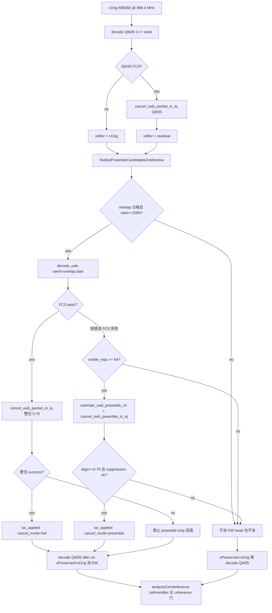
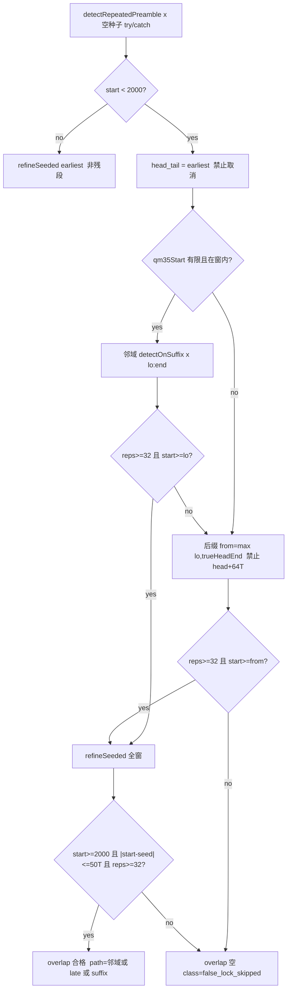

# dump 窗 DW1000：跳过窗头残段 + Preamble-only SIC

| 字段 | 值 |
|---|---|
| Author | TBD |
| Date | 2026-08-18（Rev 4：MATLAB local 按文件拆开，禁止跨文件调用 `findDw` 的 private helper） |
| Status | Draft |
| Branch | `gnuradio-scheduled-dump`（**禁止**合并到 `acceleration`） |
| 数据 | `F:\UWB基带数据\qm35_gain1_scheduled_sc16_dump_20260817` |
| 前置分析 | [`markdowns/DW1000_dump窗解调失败_假锁与窗头截断.md`](F:\USRP数据解调\markdowns\DW1000_dump窗解调失败_假锁与窗头截断.md) |
| 分析脚本 | [`analyze_dump_dw1000_decode_failures.m`](F:\USRP数据解调\analyze_dump_dw1000_decode_failures.m) |
| 实现对象 | dump SIC 的 DW 搜索 + 残段/贴边包的 SYNC-only 消除 |
| 读者 | OpenCode（按本文顺序改代码；标识符保持英文） |

本文是给编码 agent 的**可执行规格**。根因已在分析文档里闭合，不要重开“要不要固定延迟 / 要不要降 0.70 / 要不要改全局最早优先”的讨论。

---

## Overview

`scheduledDumpSicPipeline` 在 gain1 dump 的 68 个 v2-`interfered` 窗上：QM35 先消，再对残差做**空种子** `decode_uwb` 搜 DW1000。52 窗 FCS 通过并走现有整包消除；16 窗 FCS 失败。根因是搜索几何，不是随机误码。

- **Class A 假锁（7）**：`1, 24, 28, 51, 55, 74, 78`。检测器锁在窗头 27–969 的上一包 SYNC 残尾；窗内 282k–315k 还有完整 256 SYNC，紧贴 QM35（~300 μs）。pkt 24 已复检：无种子 `start=720` / 41 峰；种子 288696 → 256 峰。有种子整包解调仍在 PHR 处抛 `Input ternarySymbols is too short`——SIC **不需要** FCS。
- **Class B 窗头截断（9）**：`5, 9, 32, 36, 59, 63, 82, 86, 90`。上一包起点在窗外 150–230 μs，检测器锁残尾；后包起点 ≥322k，SFD 越过 `latestOk=320832`。后包仍有 223–256 个可见 SYNC，并与 QM35 重叠。消窗头残尾对 QM35 CIR **无帮助**。

本设计只改 dump SIC 支路：

1. **跳过窗头残段，在 `x(qm35−80μs : end)` 上搜重叠 DW**。`start > qm35+40μs` **仍接受**（只改 `search_path` 标签）。禁止用 64 峰封顶的 `detected_repetitions` 当残尾游标。禁止从样点 1 起固定延迟。
2. 重叠候选若整包 FCS 过，走**现有** `cancel_uwb_packet_in_iq`（0.70 不动）。
3. 否则若可见 SYNC ≥ 64，走**新函数** `cancel_uwb_preamble_in_iq`：只减 SYNC，不要 PHR/PSDU/FCS。
4. **永远不要**用假锁起点（~500）或窗头残段剩余（~65k）去减——那会打穿 QM35。

`+uwbdecoder/detectRepeatedPreamble.m` 的“最早包优先、≥32 峰即返回”语义保持不动。连续 `.dat` 与 QM35 有种子解调仍依赖它。

---

## Background & Motivation

### 当前 dump SIC 顺序

[`scheduledDumpSicPipeline.m`](F:\USRP数据解调\scheduledDumpSicPipeline.m) `processOneDumpWindow`（约 L98–172）：

```text
resampled window xOrig  (589056 @ 998.4 MHz)
  → decode_uwb QM35（C++ seed window.seeded_start_one ≈ 300 μs）
  → 若 QM35 FCS：cancel_uwb_packet_in_iq → xAfterQm35
  → decodeDw1000OnWindow(xAfterQm35)     % 空种子，最早包优先
  → 仅当 DW FCS：cancel_uwb_packet_in_iq(xOrig, ...)  % QM35 保留
  → 再 decode QM35，打 before/after CIR
```

`decodeDw1000OnWindow`（L174–194）对 `dw1000_code10_n256` 再 `dw1000_code11_n128` 各调一次空种子 `decode_uwb`。FCS 过立即返回；否则留下第一个没抛错的候选。

`detectAdaptivePreamble`（[`+uwbdecoder/detectRepeatedPreamble.m`](F:\USRP数据解调\+uwbdecoder\detectRepeatedPreamble.m) L148–151）：

```matlab
if candidatePreamble.detected_repetitions >= 32
    preamble = candidatePreamble;
    return;
end
```

窗头几乎总有上一包 DW 残尾（5.133 ms 对 5.000 ms 走动的几何结果）。残尾凑出 ≥32 峰就停。随后 SFD 按配置的 256 符号去搜，落在窗中后段噪声 / QM35 残差上，PHR/FCS 是垃圾。

### 窗几何（998.4 MHz）

| 量 | 样点 | 时间 |
|---|---:|---:|
| native 窗 434995 @ 737.28 MHz，65/48 | **589056** | ~590 μs |
| 1 SYNC | 1016 | 1.0176 μs |
| DW 256 SYNC | 260096 | 260.6 μs |
| SHR 256+8 | 268224 | 268.7 μs |
| 本窗还能放下完整 SHR 的最晚起点 `latestOk` | 320832 | 321.3 μs |
| QM35 64 SYNC | 65024 | 65.1 μs |
| 成功 DW 最早起点 | 9174 | ~9.2 μs |
| 16 次失败锁点 | 27–969 | < 1 μs |
| 残段门限 | 2000 | ~2.0 μs |

`latestOk = round(434995*65/48) - 264*1016 = 589056 - 268224 = 320832`（与分析脚本一致）。`validateCaptureLength` 在 `start + 264*period - 1 > N` 时失败，即 `start ≥ 320833` 才报短。Class B 后包 ≥322017，用不到这个 off-by-one。

`detected_repetitions` 成功/失败都常报 64，因为

```text
maxPeaks = min(preamble_repetitions, max(64, cir_repetitions))
         = min(256, 64) = 64
```

**不能**用它当“真实 SYNC 个数”，也不能用它算残尾结束 `tailEnd = start + detected_reps*period`。Class B 窗头实际可见 ~68–107 个 SYNC；跟踪停在 64 之后**还剩 4–43 个峰**。`detectOnSuffix(rx, from≈65k)` 会把剩余残尾当“最早包”交出来（pkt 63/90 剩余 ≥32）。有种子 refine **不**封顶 64（`buildDirectSeededPreamble` L114–116：`min(preamble_repetitions, available)`）。

### 当前消除器为何救不了这 16 窗

[`cancel_uwb_packet_in_iq.m`](F:\USRP数据解调\cancel_uwb_packet_in_iq.m)：

- L47–50：`available < preamble_repetitions * periodRx`（256 SYNC 必须进窗）就报错。
- [`generate_uwb_tx_from_decode.m`](F:\USRP数据解调\generate_uwb_tx_from_decode.m)：要 PSDU bit；`require_fcs_pass` 默认 true。
- L98–101 / L169：`min_alignment_correlation = 0.70`。packet 47 是 FCS 过但 0.691 < 0.700，**本设计不修**。

pkt 24 有种子整包解调在 `helpers/helperUWBBPRFDemod.m` L84 抛 `Input ternarySymbols is too short: need samples 144865:154080`。真包靠窗尾，PHR/载荷贴边。CIR 其实已经算完，但 `decode_uwb` 整函数抛错，结果丢了。

Class B 后包 `start ≥ 322017` 时，`validateCaptureLength` 要求

```text
requiredEnd = start + (256+8)*period - 1 > 589056
```

`decode_uwb` 在 CIR 之前就抛 `validateCaptureLength:CaptureTooShort`。

因此必须有一条**不经过** `validateCaptureLength` / SFD / PHR 的 preamble+CIR 路径。禁止削弱 `decode_uwb` 给连续捕获用的校验。

---

## Goals & Non-Goals

### Goals

1. Class A 7 窗：跳过窗头残段，锁到后段重叠 DW（pkt 24 目标起点 ~288696，允许数个 SYNC 周期误差）。
2. Class B 9 窗：不要用窗头残尾（pkt 5 不要用 446，更不要用 ~65k 的 64 峰残尾游标）去消除；锁后包（pkt 5 ~322017，pkt 90 ~362017）并做 preamble-only SIC。
3. 重叠候选 FCS 过 → 现有整包消除，行为与今天一致（含 packet 47 仍因 0.70 被拒）。
4. FCS 不过或 `decode_uwb` 抛错，但可见 SYNC ≥ 64 → `cancel_uwb_preamble_in_iq`，只减可见 SYNC。
5. 记录搜索/消除分类字段；`sic_applied = logical(dw_cancel.success)`，禁止 `packCancelReport` 在 `raw.success==false` 时强行 true。
6. 合成单元测试不依赖 live dump。有数据时对 pkt 24 / 5 / 47 + 一个早起点成功窗做冒烟。
7. 文档交叉引用。不提交 `*.mat` / `*.fig` / `*.dat` / `*.bin` / `*.iq`。

### Non-Goals / 禁止事项（OpenCode 不得违反）

| 禁止 | 原因 |
|---|---|
| 改 [`+uwbdecoder/detectRepeatedPreamble.m`](F:\USRP数据解调\+uwbdecoder\detectRepeatedPreamble.m) 全局最早优先 | 连续 `.dat`、QM35 有种子解调依赖它 |
| 改 `cancel_uwb_packet_in_iq` 的 `min_alignment_correlation` 0.70 | packet 47 明确 out of scope |
| 给 FCS 已过、整包消除因 0.70 失败的窗（packet 47）再走 preamble-only | 等于绕过 0.70“修”47 |
| 改 v2 预径簇检测器（`analyzeCirInterference` / `locateCirFirstPeak` / N≥5 入口） | 选窗已闭合 |
| 用 `cir_coherence ≥ 0.99` 或 occupancy / N 当 SIC 成功门 | v2 设计已废除 |
| 发布新的 `sic_success` 布尔（occupancy/coherence 洗白） | 硬约束 |
| 从样点 1 固定跳过 80–120 μs | 会杀掉 start≈9174 的真包 |
| 用假锁起点（~500 / 16 失败的 27–969）或 64 峰残尾游标（~65k）调用任何 cancel | 会打掉窗中段，含 QM35 |
| 用 `detected_repetitions`（常为 64）算 `tailEnd` 再 `detectOnSuffix` | pkt 63/90 剩余头 ≥32 峰，会再锁残段并 `visibleReps=256` 消穿 QM35 |
| 因 `start > qm35+40μs` 丢掉 `x(lo:end)` 已经找到的后包 | 40 μs 只是标签，不是“不再重叠” |
| 改 `sic_pipeline/`，或把它接到 `.dat`，或在那里复制 dump 逻辑 | 连续文件 SIC 另案 |
| 把本分支合并进 `acceleration` | 硬约束 |
| 削弱 `decode_uwb` / `validateCaptureLength` / `estimateCirAndSoftChips` 的长度校验 | 连续捕获仍要完整 SHR |
| 改 `uwbdecoder.defaultOptions` 塞 dump-SIC 旋钮 | 旋钮放 `normalizeDumpSicConfig` |
| 提交数据或 MATLAB 二进制 | 已 gitignore |

---

## Key Decisions

OpenCode **必须按下列默认实现**，除非用户事后改口。

1. **残段门限 `head_fragment_max_start = 2000`（~2 μs）。**  
   16 次失败锁点 ≤969；最早 FCS 成功 = 9174。空隙大。只用 `start_sample < 2000` 判定残段，**不要**用 `start+(detected_reps-256)*period` 反推原点。

2. **跳过残段后，主搜索是 `x(lo:end)`，`lo = qm35Start − 80e-6*fs`。`start > hi` 仍是命中。**  
   - `hi = qm35Start + 40e-6*fs` **只用于打标签**：`start <= hi` → `search_path="qm35_neighborhood"`；`start > hi` → `search_path="late_after_qm35"`。  
   - 邻域成功谓词：`isValidDetect(neigh) && neigh.start_sample >= lo`（remap 后 `start >= lo` 本就成立；`start < lo` 的 polyfit 截距要丢）。**不要**把 `start <= hi` 当 miss。  
   - 检测必须用 `x(lo:end)`，**禁止**裁成 `x(lo:hi)`（pkt 5 在 `[lo,hi]` 内只剩 ~17 SYNC）。  
   - **禁止** `from = head_start + detected_repetitions*period`（64 封顶）。后缀若仍需要：`from = max(lo, trueHeadEnd)`，其中 `trueHeadEnd` 用几何容量 `min(preamble_repetitions, floor((N-head_start+1)/period))`，不是 64。`qm35Start` 非有限时跳过邻域，`from = max(headFragMax, trueHeadEnd)`，**禁止**让 `lo` 塌成 1。  
   - 禁止全局固定延迟。

3. **`min_visible_sync_for_preamble_sic = 64`。**  
   与 DW profile `cir_repetitions=64` 一致。`overlap_reps` 必须是有种子 refine 后的 `visibleReps`（几何容量），不是自适应 `detected_repetitions`。

4. **新文件 `cancel_uwb_preamble_in_iq.m`，不要给整包消除加 mode 开关。**  
   对齐/CFO/增益局部函数**复制**到新文件。`fillPreambleCancelOptions` 在任何 fill-if-empty 之后**强制** `enable_full_packet_sfo=false`、`enable_cir_slow_phase=false`。

5. **不改 `detectRepeatedPreamble.m`。**  
   对后缀/邻域调用 `detectRepeatedPreamble(x(from:end), ref, params, [])`，再 `shiftPreamble(..., from-1)`。全部 dump-SIC 坐标都是**未裁的窗内一基下标**（1…589056）。

6. **preamble-only 对齐门限仍是 0.70。** 失败就跳过，不降门。

7. **两个 PR：** (1) 搜索包装 + 单测；(2) preamble-only 消除 + 管线接线 + 冒烟 + 文档。

8. **FCS 已过只走整包消除。** 整包因对齐/抑制失败时**禁止**回落到 preamble-only（锁死 packet 47）。

9. **永远不消 `head_tail`，也不消 64 峰残尾游标上的“假 overlap”。** overlap 的 `start_sample` 必须 `>= head_fragment_max_start`。

10. **preamble-only 不调用 `validateCaptureLength` / `cropToFrame` / `refineTimingWithNsSfd` / `estimateCirAndSoftChips` / `decodePhrAndPayload`。**  
    `estimate_uwb_preamble_cir` 优先复用 `search.overlap_preamble`（已是有种子 refine 的结果）；只有缺 preamble 时才再 detect。

11. **Refine 护栏看“是不是回退到窗头”，不要用 2T。**  
    `buildDirectSeededPreamble` 会从种子往回走最多 **4** 个 SYNC；`|start−seed|` 达 3–4T 是成功路径。窗头回退跳的是 ~280k 样点，不是 2T。拒绝当且仅当：`start < head_fragment_max_start` **或** `|start−seed| > 50*period` **或** `detected_repetitions < 32`。`estimate_uwb_preamble_cir` 用同一谓词。

12. **`cfo_fit_last_sync` / `gain_fit_last_sync` = `visible_reps`。** SFO / CIR slow-phase **强制关**（不是 fill-if-empty）。不复制 `selectFieldModel`，不读 `decoded.cir`。

13. **`visibleReps` 用 `finitePeriod(measured_period, ref.samples_per_symbol)`**，禁止写死 1016（128 样点单测在 `measured_period` 非有限时会错）。

14. **第一个合格 overlap 的 profile 冻结，供 preamble-only 使用。**  
    只在 `candidate.payload.fcs_pass` 时覆盖 `decoded/profile/search` 并 `return`。code-11 的 FCS 尝试可以继续，但 **不得**在 throw / FCS 失败时用 code-11 覆盖已保存的 code-10 overlap。  
    **也不得**把后来 profile 的 FCS 失败 `decoded` 装箱，却用冻结的 first-overlap profile 去做 preamble-only（CSV `dw.start_sample` 会对不上）。返回的 `decoded` 必须属于冻结的 `profile`；否则 `decoded=[]`，交给 C.3 的 `elseif isfinite(overlap_start)` 填 `decode_ok` / `start_sample`。

15. **`sic_applied = logical(record.dw_cancel.success)`。** `packCancelReport` 若 `raw` 带 `success==false` 必须保留 false。

---

## Proposed Design

### 坐标系（全部 dump SIC）

所有搜索、CIR、消除都在 **未裁的窗向量** 上工作，下标 1-based，长度约 589056。`detectOnSuffix` 在 `x(from:end)` 上得到的 `start_sample` / `peaks` / `roi_*` / `strongest_end` 必须先 `+ (from-1)`，再和 `lo` / `hi` / `visibleReps` / refine 种子比较。

`estimate_uwb_preamble_cir` 不裁窗，不会写 `start_sample_uncropped`。`cancel_uwb_preamble_in_iq` **一律**用 `preamble.start_sample` 作为窗内一基下标。不要读 `start_sample_uncropped`，除非同时存在 `crop_start_sample` 并且做 `start + crop_start - 1`（dump SIC 默认不裁，`crop_start` 视为 1）。

冒烟“禁止 start≈446”比较的是 **`dw_cancel.start_sample`（消除报告）**，不是 `record.dw.start_sample`。

### 架构



搜索子流程：



### A. 搜索包装（只给 dump SIC 用）

**路径（仓库根，与 `scheduledDumpSicPipeline.m` 同级）：**  
`F:\USRP数据解调\findDwPreambleCandidatesOnWindow.m`

不要放进 `+uwbdecoder/`。不要做成 `scheduledDumpSicPipeline.m` 的 local function。

**Rev-1 草稿已从工作区删除。** 若 `findDwPreambleCandidatesOnWindow.m` 或 `tests/testFindDwPreambleCandidatesOnWindow.m` 再次出现、且仍带 Rev-1 反模式（`start_sample <= hi` 当 miss、`detected_repetitions * period` 当残尾游标、`refine_max_abs_start_err_periods` 默认 2），OpenCode **必须整文件按 A.0–A.1b / D.1 覆盖**。禁止在旧稿上打补丁，禁止因“文件已在 / 三测已绿”而跳过。见 OpenCode 清单 §1 与 PR 1。

```matlab
function search = findDwPreambleCandidatesOnWindow(rx, profile, qm35Start, opts)
%FINDDWPREAMBLECANDIDATESONWINDOW Dump-SIC search: skip head fragment, find overlap DW.
%   SEARCH = FINDDWPREAMBLECANDIDATESONWINDOW(RX, PROFILE, QM35START)
%   RX is the post-QM35-cancel work-rate window. PROFILE is one
%   refs.dw_profiles(k) (params / reference). QM35START is
%   window.seeded_start_one (one-based). OPTS may be omitted; defaults
%   are filled internally (tests call the 3-arg form).
%
%   Does not modify detectRepeatedPreamble. Head tails are never returned
%   as the overlap candidate.
```

单测合法调用：`findDwPreambleCandidatesOnWindow(rx, profile, qm35Start)`（第四参省略，函数内 fill）。

#### A.0 `opts` 默认与返回 struct

```matlab
function opts = fillSearchOpts(opts)
if nargin < 1 || isempty(opts)
    opts = struct();
end
defaults = struct( ...
    'fs', 998.4e6, ...
    'head_fragment_max_start', 2000, ...
    'qm35_search_pre_s', 80e-6, ...
    'qm35_search_post_s', 40e-6, ...
    'min_detect_reps', 32, ...
    'refine_max_abs_start_err_periods', 50);
names = fieldnames(defaults);
for k = 1:numel(names)
    if ~isfield(opts, names{k}) || isempty(opts.(names{k}))
        opts.(names{k}) = defaults.(names{k});
    end
end
end
```

| 字段 | 默认 | 含义 |
|---|---:|---|
| `fs` | `998.4e6` | 工作采样率 |
| `head_fragment_max_start` | `2000` | 残段门限（样点） |
| `qm35_search_pre_s` | `80e-6` | 邻域左端（只定 `lo`） |
| `qm35_search_post_s` | `40e-6` | **只定 `hi` 标签**，不是命中门 |
| `min_detect_reps` | `32` | 与检测器提交门一致 |
| `refine_max_abs_start_err_periods` | **50** | 防整段回退到窗头；必须大于 seeded 回走 4T |

```matlab
function search = emptySearchResult(qm35Start)
search = struct( ...
    'head_start', NaN, ...
    'head_reps', 0, ...
    'head_is_fragment', false, ...
    'head_period', NaN, ...
    'overlap_start', NaN, ...          % 必须是 NaN，禁止 0（isfinite(0) 为 true）
    'overlap_reps', 0, ...
    'overlap_detected_reps', 0, ...
    'overlap_period', NaN, ...
    'overlap_preamble', struct(), ...
    'search_path', "", ...
    'qm35_start', double(qm35Start), ...
    'message', "");
end
```

`search_path` 取值：`"earliest"` / `"qm35_neighborhood"` / `"late_after_qm35"` / `"suffix_after_head"` / `"none"`。

**`emptyDwSearch` / `searchOptsFromCfg` 不是本文件的 local。** 它们属于 `scheduledDumpSicPipeline.m`（见 C.2 之后的管线 locals）。本文件不得定义这两个名字，管线也不得调用本文件的 `emptySearchResult` / `fillSearchOpts`。

#### A.1 算法（按此粘贴实现）

```matlab
if nargin < 4
    opts = struct();
end
opts = fillSearchOpts(opts);

params = profile.params;
ref = profile.reference;
fs = opts.fs;
periodNom = ref.samples_per_symbol;
headFragMax = opts.head_fragment_max_start;
search = emptySearchResult(qm35Start);
rx = rx(:);

try
    earliest = uwbdecoder.detectRepeatedPreamble(rx, ref, params, []);
catch
    search.search_path = "none";
    search.message = "earliest detect failed";
    return
end
period = finitePeriod(earliest.measured_period, periodNom);

if earliest.start_sample >= headFragMax
    search.head_is_fragment = false;
    search.head_start = NaN;
    try
        refined = refineSeeded(rx, ref, params, earliest.start_sample, opts);
        search = acceptOverlap(search, refined, rx, params, "earliest");
    catch
        search.search_path = "none";
        search.message = "earliest refine failed";
    end
    return
end

search.head_is_fragment = true;
search.head_start = double(earliest.start_sample);
search.head_reps = double(earliest.detected_repetitions);
search.head_period = period;

trueHeadEnd = search.head_start + ...
    min(params.preamble_repetitions, ...
        floor((numel(rx) - search.head_start + 1) / period)) * period;

qm35Ok = isfinite(qm35Start) && qm35Start >= 1 && qm35Start <= numel(rx);
if qm35Ok
    lo = max(1, round(double(qm35Start) - opts.qm35_search_pre_s * fs));
    hi = min(numel(rx), round(double(qm35Start) + opts.qm35_search_post_s * fs));
    try
        neigh = detectOnSuffix(rx, ref, params, lo);
        if isValidDetect(neigh, opts) && neigh.start_sample >= lo
            refined = refineSeeded(rx, ref, params, neigh.start_sample, opts);
            if refined.start_sample >= lo
                if refined.start_sample <= hi
                    pathName = "qm35_neighborhood";
                else
                    pathName = "late_after_qm35";
                end
                search = acceptOverlap(search, refined, rx, params, pathName);
                return
            end
        end
    catch
        % 邻域未命中，走后缀
    end
    suffixFrom = max([lo, headFragMax, round(trueHeadEnd)]);
else
    suffixFrom = max(headFragMax, round(trueHeadEnd));
end

suffixFrom = min(max(suffixFrom, headFragMax), numel(rx));
try
    suf = detectOnSuffix(rx, ref, params, suffixFrom);
    if isValidDetect(suf, opts) && suf.start_sample >= suffixFrom
        refined = refineSeeded(rx, ref, params, suf.start_sample, opts);
        search = acceptOverlap(search, refined, rx, params, "suffix_after_head");
        return
    end
catch
end

search.search_path = "none";
search.message = "head fragment skipped; no overlap candidate";
```

要点（实现时对照，不要“优化”回去）：

- **每一个** `detectRepeatedPreamble` / `detectOnSuffix` / `refineSeeded` 都在 try/catch 里，包括非残段 earliest 路径。refine 抛错不得让整窗 SIC 崩掉。
- `trueHeadEnd` 用配置的 `preamble_repetitions`（256）与窗几何，**不用** `detected_repetitions`。
- `qm35Start` 非有限 / 越界：不算 `lo/hi`（`max(1,NaN)` 在 MATLAB 是 1，会变成整窗搜索并再锁窗头）。
- 邻域命中**不**要求 `start <= hi`。

#### A.1b `findDwPreambleCandidatesOnWindow.m` 的 local（按此粘贴；仅本文件可见）

```matlab
function preamble = detectOnSuffix(rx, ref, params, firstSample)
    if firstSample <= 1
        preamble = uwbdecoder.detectRepeatedPreamble(rx, ref, params, []);
        return
    end
    if firstSample >= numel(rx) - ref.samples_per_symbol
        error('findDwPreambleCandidatesOnWindow:SuffixTooShort', ...
            'Search suffix starts at %d but window is %d.', firstSample, numel(rx));
    end
    preamble = uwbdecoder.detectRepeatedPreamble( ...
        rx(firstSample:end), ref, params, []);
    preamble = shiftPreamble(preamble, firstSample - 1);
end

function preamble = shiftPreamble(preamble, offset)
    preamble.start_sample = preamble.start_sample + offset;
    if isfield(preamble, 'peaks') && ~isempty(preamble.peaks)
        preamble.peaks = preamble.peaks + offset;
    end
    if isfield(preamble, 'strongest_end')
        preamble.strongest_end = preamble.strongest_end + offset;
    end
    if isfield(preamble, 'roi_start')
        preamble.roi_start = preamble.roi_start + offset;
    end
    if isfield(preamble, 'roi_end')
        preamble.roi_end = preamble.roi_end + offset;
    end
end

function ok = isValidDetect(preamble, opts)
    ok = isstruct(preamble) && isfield(preamble, 'start_sample') ...
        && isfield(preamble, 'detected_repetitions') ...
        && preamble.detected_repetitions >= opts.min_detect_reps ...
        && isfinite(preamble.start_sample) ...
        && preamble.start_sample >= opts.head_fragment_max_start;
end

function preamble = refineSeeded(rx, ref, params, seed, opts)
    preamble = uwbdecoder.detectRepeatedPreamble(rx, ref, params, seed);
    period = finitePeriod(preamble.measured_period, ref.samples_per_symbol);
    maxErr = opts.refine_max_abs_start_err_periods * period;
    fellToHead = preamble.start_sample < opts.head_fragment_max_start;
    tooFar = abs(double(preamble.start_sample) - double(seed)) > maxErr;
    tooFew = preamble.detected_repetitions < opts.min_detect_reps;
    if fellToHead || tooFar || tooFew
        error('findDwPreambleCandidatesOnWindow:RefineFellBack', ...
            ['Seeded refine at %d fell back to start=%d reps=%d ', ...
             '(head fallback or too few peaks).'], ...
            seed, preamble.start_sample, preamble.detected_repetitions);
    end
end

function tf = isValidRefine(preamble, seed, opts, periodNom)
    % 仅供只读检查。refineSeeded 已按同一谓词 error；A.1 用 try/catch，
    % 不要再套一层 if isValidRefine。
    period = finitePeriod(preamble.measured_period, periodNom);
    tf = preamble.start_sample >= opts.head_fragment_max_start ...
        && preamble.detected_repetitions >= opts.min_detect_reps ...
        && abs(double(preamble.start_sample) - double(seed)) <= ...
            opts.refine_max_abs_start_err_periods * period;
end

function n = visibleReps(preamble, rx, params, periodNom)
    period = finitePeriod(preamble.measured_period, periodNom);
    n = min(params.preamble_repetitions, ...
        floor((numel(rx) - double(preamble.start_sample) + 1) / period));
    n = max(0, n);
end

function search = acceptOverlap(search, refined, rx, params, pathName)
    fallback = uwbdecoder.constants().HRP_CHIPS_PER_SYMBOL;  % 1016
    search.overlap_start = double(refined.start_sample);
    search.overlap_reps = visibleReps(refined, rx, params, fallback);
    search.overlap_detected_reps = double(refined.detected_repetitions);
    search.overlap_period = finitePeriod(refined.measured_period, fallback);
    search.overlap_preamble = refined;
    search.search_path = string(pathName);
    search.message = "";
    if ~(isfinite(search.overlap_start) && search.overlap_start >= 2000)
        error('findDwPreambleCandidatesOnWindow:AcceptedHead', ...
            'Refusing to accept overlap start %g.', search.overlap_start);
    end
end

function p = finitePeriod(measured, fallback)
    if isfinite(measured) && measured > 0
        p = double(measured);
    else
        p = double(fallback);
    end
end
```

本文件 **到此结束** local 名单（仅这 9 个）：`fillSearchOpts`、`emptySearchResult`、`detectOnSuffix`、`shiftPreamble`、`isValidDetect`、`refineSeeded`、`visibleReps`、`acceptOverlap`、`finitePeriod`。  
**不要**在本文件里写 `emptyDwSearch` 或 `searchOptsFromCfg`。`isValidRefine` 若实现也只给本文件只读用，管线 / CIR 助手不得调用。

`visibleReps` 在 `measured_period` 有限时用它（单测里 refine 后是 `symbolLength=128`）；只有 NaN 才 fallback 到 `HRP_CHIPS_PER_SYMBOL`（1016）。禁止把 1016 写进 `visibleReps` 的第一选择。

#### A.2 各失败包预期路径

`lo ≈ qm35−80μs ≈ 220k`，`hi ≈ qm35+40μs ≈ 339k`（`seeded_start_one≈299520`）。`x(lo:end)` 找得到所有后包。`hi` 只改标签。

| packet | 类 | 窗头锁 | 重叠起点（分析） | 预期 `search_path` |
|---|---|---:|---:|---|
| 1 | A | 793 | 302017 | `qm35_neighborhood` |
| 24 | A | 720 | 288696 / 288617 | `qm35_neighborhood` |
| 28 | A | 373 | 308617 | `qm35_neighborhood` |
| 51 | A | 300 | 295417 | `qm35_neighborhood` |
| 55 | A | 969 | 315417 | `qm35_neighborhood` |
| 74 | A | 227 | 282017 | `qm35_neighborhood` |
| 78 | A | 896 | 302017 | `qm35_neighborhood` |
| 5 | B | 446 | 322017 | `qm35_neighborhood` |
| 32 | B | 27 | 328617 | `qm35_neighborhood` |
| 59 | B | 623 | 335417 | `qm35_neighborhood` |
| 82 | B | 550 | 322017 | `qm35_neighborhood` |
| 9 | B | 100 | 342017 | **`late_after_qm35`** |
| 36 | B | 696 | 348617 | **`late_after_qm35`** |
| 63 | B | 276 | 355217 | **`late_after_qm35`** |
| 86 | B | 203 | 342017 | **`late_after_qm35`** |
| 90 | B | 873 | 362017 | **`late_after_qm35`** |

`suffix_after_head` 只在邻域 detect 抛错 / 不足 32 峰、或 `qm35Start` 非有限时出现。gain1 这 16 窗预期走邻域或 `late_after_qm35`，**不应**再走到被 64 峰污染的残尾后缀。

Class B 64 峰后剩余（说明为何禁止 `head+64T`）：

| packet | 窗头可见 SYNC（约） | 64 峰后剩余 | 后包 |
|---|---:|---:|---:|
| 63 | ~101 | **37 ≥ 32** | 355217 |
| 90 | ~107 | **43 ≥ 32** | 362017 |
| 36 | ~95 | ~31（贴边） | 348617 |
| 9 / 86 | ~88 | ~24 < 32 | 342017 |
| 5 / 82 | ~68 | ~4 < 32 | 322017 |

若错误地 `from≈65k`，pkt 63/90 会把剩余头当 overlap；`visibleReps` 几何容量 = 256，preamble-only 会从 ~65k 减到 ~326k，**打穿 QM35**。

### B. Preamble-only SIC

#### B.1 新文件 `estimate_uwb_preamble_cir.m`

仓库根。**不要**改 `decode_uwb.m`。

```matlab
function [preamble, cir, rxOut] = estimate_uwb_preamble_cir( ...
        rx, reference, params, seededStart, preparedPreamble)
%ESTIMATE_UWB_PREAMBLE_CIR CIR from visible SYNC only (no SHR / PHR check).
%   PREPAREDPREAMBLE is optional. If it is a struct with start_sample
%   near SEEDEDSTART, reuse it and skip a second detectRepeatedPreamble.
```

**禁止**调用 `findDwPreambleCandidatesOnWindow.m` 的 local（`visibleReps` / `refineSeeded` / `finitePeriod` 在本文件里看不见）。护栏和可见 SYNC 数必须在本文件**内联**。

步骤：

1. `seededStart` 必须有限且在 `1:numel(rx)`，否则 error `estimate_uwb_preamble_cir:BadSeed`。
2. 内联 refine 谓词（不要写 `refineSeeded(...)`）：

```matlab
period = reference.samples_per_symbol;
if isstruct(preambleCheck) && isfield(preambleCheck, 'measured_period') && ...
        isfinite(preambleCheck.measured_period) && preambleCheck.measured_period > 0
    period = double(preambleCheck.measured_period);
end
okPreamble = isstruct(preambleCheck) && isfield(preambleCheck, 'start_sample') ...
    && preambleCheck.start_sample >= 2000 ...
    && isfield(preambleCheck, 'detected_repetitions') ...
    && preambleCheck.detected_repetitions >= 32 ...
    && abs(double(preambleCheck.start_sample) - double(seededStart)) <= 50 * period;
```

若 `nargin >= 5` 且 `preparedPreamble` 通过上述 `okPreamble`（把 `preambleCheck` 换成它），则 `preamble = preparedPreamble`。否则：
`preamble = uwbdecoder.detectRepeatedPreamble(rx, reference, params, seededStart)`，再用同一段内联谓词；失败 → `estimate_uwb_preamble_cir:SeedFallback`。
3. **不要用 2T。** 4T 回走是 seeded 成功路径。
4. 内联可见 SYNC 数（不要写 `visibleReps(...)`）：

```matlab
period = preamble.measured_period;
if ~(isfinite(period) && period > 0)
    period = reference.samples_per_symbol;
end
visible = min(params.preamble_repetitions, ...
    floor((numel(rx) - double(preamble.start_sample) + 1) / period));
visible = max(0, visible);
p = params;
p.preamble_repetitions = min(params.preamble_repetitions, visible);
```

5. 可选 CFO：`try [rxOut, preamble] = uwbdecoder.compensateCarrierOffset(rx, preamble, reference, p); catch rxOut = rx; end`。
6. `cir = uwbdecoder.estimateCir(rxOut, preamble, reference, p)`。必须用步骤 2 的**有种子** preamble（`detected_repetitions` ≈ visible，不是自适应 64）。这样 `estimateCir` 的 skip-10 / last-64 落在真包末尾，而不是 64 封顶的头 64。
7. 不要 `enable_frame_crop`。不要 SFD。

管线 C.3 **必须**传入 `dwSearch.overlap_preamble`，避免二次 detect。助手仍保留 seed 参数做护栏。

#### B.2 新文件 `cancel_uwb_preamble_in_iq.m`

与 [`cancel_uwb_packet_in_iq.m`](F:\USRP数据解调\cancel_uwb_packet_in_iq.m) 同级。**不要**改那个文件。

```matlab
function [rxOut, report] = cancel_uwb_preamble_in_iq( ...
        rx, preamble, cir, txOptions, opts)
%CANCEL_UWB_PREAMBLE_IN_IQ Subtract a SYNC-only replica from work-rate IQ.
```

**输入**

| 参数 | 内容 |
|---|---|
| `rx` | **`xOrig`**（QM35 保留） |
| `preamble` | `start_sample` = 窗内一基；`measured_period`；`detected_repetitions` |
| `cir` | `estimateCir` 输出 |
| `txOptions` | `code_index`、`visible_reps`、`fs_tx`、`phy_mode`、`peak_amplitude`、`guard_samples` |
| `opts` | 见 `fillPreambleCancelOptions` |

```matlab
function opts = fillPreambleCancelOptions(opts, visible)
if nargin < 1 || isempty(opts)
    opts = struct();
end
defaults = struct( ...
    'fs_rx', 998.4e6, ...
    'cancellation_mode', 'optimal_complex', ...
    'alignment_search_samples', 128, ...
    'alignment_template_syncs', 32, ...
    'cfo_fit_first_sync', 25, ...
    'cfo_fit_last_sync', visible, ...
    'gain_fit_first_sync', 25, ...
    'gain_fit_last_sync', visible, ...
    'fractional_alignment_max_samples', 0.75, ...
    'fractional_alignment_coarse_step', 0.10, ...
    'fractional_alignment_fine_step', 0.003, ...
    'fractional_alignment_min_improvement', 5e-4, ...
    'min_alignment_correlation', 0.70, ...
    'min_frame_suppression_db', 0.20, ...
    'max_abs_cfo_hz', 100e3, ...
    'enable_cir_slow_phase', false, ...
    'enable_full_packet_sfo', false, ...
    'min_visible_sync_for_preamble_sic', 64);
names = fieldnames(defaults);
for k = 1:numel(names)
    if ~isfield(opts, names{k}) || isempty(opts.(names{k}))
        opts.(names{k}) = defaults.(names{k});
    end
end
% 强制：即使调用方 / 从 dwProfile.cancel 拷来的结构把这两项设成了 true。
opts.enable_full_packet_sfo = false;
opts.enable_cir_slow_phase = false;
if opts.cfo_fit_first_sync > visible
    opts.cfo_fit_first_sync = 1;
end
if opts.gain_fit_first_sync > visible
    opts.gain_fit_first_sync = 1;
end
opts.cfo_fit_last_sync = visible;
opts.gain_fit_last_sync = visible;
if opts.alignment_template_syncs > visible
    opts.alignment_template_syncs = visible;
end
end
```

禁止 `opts = fillCancelOptions(opts)` 之后只填空字段——`fillCancelOptions` 默认 `enable_cir_slow_phase=true`、`enable_full_packet_sfo=true`，会去调 `estimate_uwb_cir_slow_phase(decoded.cir, ...)`。preamble-only **没有** `decoded`，一调就抛，C.3 catch 后 16 窗全跳过。

**行为**

1. `visible = txOptions.visible_reps`。`visible < opts.min_visible_sync_for_preamble_sic` → `cancel_uwb_preamble_in_iq:TooFewSync`。
2. SYNC-only `tx`（不要 `generate_uwb_tx_from_decode`）：

```matlab
cfg = lrwpanHRPConfig(Mode='802.15.4a', MeanPRF=62.4, ...
    DataRate=6.81, SamplesPerPulse=2, ...
    CodeIndex=txOptions.code_index, PreambleDuration=64, ...
    Ranging=true, PSDULength=1);
[~, pulseSymbols] = lrwpanWaveformGenerator(zeros(8, 1), cfg);
indices = lrwpanHRPFieldIndices(cfg);
samplesPerSync = (indices.SYNC(2) - indices.SYNC(1) + 1) / cfg.PreambleDuration;
assert(abs(samplesPerSync - round(samplesPerSync)) < 1e-9);
samplesPerSync = round(samplesPerSync);
expectedSync = uwbdecoder.constants().HRP_CHIPS_PER_SYMBOL;
if abs(cfg.SampleRate - opts.fs_rx) > 1
    error('cancel_uwb_preamble_in_iq:SampleRate', ...
        'Generator rate %.3f Hz != fs_rx.', cfg.SampleRate);
end
if samplesPerSync ~= expectedSync
    error('cancel_uwb_preamble_in_iq:SyncLen', ...
        'samplesPerSync=%d, expected %d.', samplesPerSync, expectedSync);
end
symbolsPerSync = samplesPerSync / cfg.SamplesPerPulse;
syncPulseSymbols = pulseSymbols(1:round(symbolsPerSync));
pulseSymbolsWork = repmat(syncPulseSymbols, visible, 1);
pulseImpulsesWork = zeros(numel(pulseSymbolsWork) * cfg.SamplesPerPulse, 1);
pulseImpulsesWork(1:cfg.SamplesPerPulse:end) = pulseSymbolsWork;

tx = struct();
tx.pulse_impulses_work = pulseImpulsesWork;
tx.sample_rate_work = cfg.SampleRate;
tx.sample_rate_tx = opts.fs_rx;
tx.digital_offset_hz = 0;
tx.guard_samples = 0;
tx.preamble_repetitions = visible;
```

单测若用 `symbolLength≠1016` 的搜索包装，不走这个生成器。D.2 用真实 HRP，`samplesPerSync` 必须是 1016。

3. `channel = apply_estimated_cir_to_uwb(tx, cir); replica = channel.waveform_x410(:);`  
   最小 `tx` 字段：`pulse_impulses_work`、`sample_rate_work`、`sample_rate_tx`、`digital_offset_hz`、`guard_samples`。不要 Butterworth `waveform_work`，不要 `field_indices_work`。
4. `nominalStart = double(preamble.start_sample)`。dump SIC 不裁窗，**不要**优先 `start_sample_uncropped`。
5. 对齐之后：

```matlab
periodRx = uwbdecoder.constants().PREAMBLE_PERIOD_S * opts.fs_rx;
available = min(numel(replica), numel(rx) - startLocal + 1);
need = round(visible * periodRx);
if available < need
    visible = floor(available / periodRx);
    if visible < opts.min_visible_sync_for_preamble_sic
        error('cancel_uwb_preamble_in_iq:ShortWindow', ...
            'Available %d samples (vis=%d) < min SYNC.', available, visible);
    end
    % 用缩小后的 visible 重新生成 replica，或 replica = replica(1:needClipped)
    need = round(visible * periodRx);
    available = need;
    replica = replica(1:available);
end
```

先对齐再裁时，若 `available < visible*periodRx`，必须先缩小 `visible` 再拟 CFO/增益，禁止顶着 `visible_reps=223` 的标签只减短副本。

6. 从 `cancel_uwb_packet_in_iq.m` **原样复制** `alignReplica`（L224–245）、`refineFractionalAlignment`、`fractionalAlignmentScore`、`applyFractionalShift`、`fitReplicaCfo`（L308–330）。CFO 帽 `max_abs_cfo_hz=100e3`。不要复制 `selectFieldModel` / `workFieldToRxIndices` / `estimate_uwb_cir_slow_phase` / `estimate_uwb_full_packet_sfo`。
7. `alignCorr < 0.70` → `cancel_uwb_preamble_in_iq:Alignment`。
8. 复增益下标（与 L104–106 相同，轴是 replica/observed 的 1-based 样点，不是 RX 全局下标）：

```matlab
gainFirst = round((opts.gain_fit_first_sync - 1) * periodRx) + 1;
gainLast  = min(available, round(opts.gain_fit_last_sync * periodRx));
gainIdx = gainFirst:gainLast;
globalGain = (replicaCfo(gainIdx)' * observed(gainIdx)) / ...
    (replicaCfo(gainIdx)' * replicaCfo(gainIdx) + eps);
```

增益下标必须是上面这段 L104–106。轴是 replica / observed 的 1-based 样点，不是窗全局下标，也不是 SYNC 序号。`alignReplica` / `fitReplicaCfo` 同样用 `firstSync` / `templateSyncs` / `periodRx`（L227–230、L308–321）。

9. `rxOut = rx; rxOut(startLocal:startLocal+available-1) = observed - globalGain*replicaCfo;` 不要 PHR/payload。
10. `report` 与 `emptyCancelReport` 对齐，另加 `cancel_mode="preamble"`、`visible_reps`。`success=true` 仅在函数正常 return 时。

### C. 管线接线

只改 [`scheduledDumpSicPipeline.m`](F:\USRP数据解调\scheduledDumpSicPipeline.m) 和 [`run_scheduled_dump_sic_pipeline.m`](F:\USRP数据解调\run_scheduled_dump_sic_pipeline.m)。不改 `sic_pipeline/`。

#### C.1 `normalizeDumpSicConfig` 新字段

与 Rev 1 相同的五个字段：`dw_head_fragment_max_start=2000`、`dw_qm35_search_pre_s=80e-6`、`dw_qm35_search_post_s=40e-6`、`min_visible_sync_for_preamble_sic=64`、`enable_preamble_only_sic=true`。

`run_scheduled_dump_sic_pipeline.m` 在用户参数区用**注释**列出这五项，便于人回滚，不必读设计文档：

```matlab
% cfg.dw_head_fragment_max_start = 2000;
% cfg.dw_qm35_search_pre_s = 80e-6;
% cfg.dw_qm35_search_post_s = 40e-6;
% cfg.min_visible_sync_for_preamble_sic = 64;
% cfg.enable_preamble_only_sic = true;  % false: 只消 FCS 过的整包；搜索仍走新包装
```

#### C.2 重写 `decodeDw1000OnWindow`

```matlab
function [decoded, profile, search] = decodeDw1000OnWindow( ...
        x, profiles, qm35Start, cfg)
decoded = [];
profile = struct();
search = emptyDwSearch();
searchOpts = searchOptsFromCfg(cfg);
firstOverlapLocked = false;

for k = 1:numel(profiles)
    try
        candSearch = findDwPreambleCandidatesOnWindow( ...
            x, profiles(k), qm35Start, searchOpts);
    catch
        continue
    end

    if ~firstOverlapLocked && isfinite(candSearch.overlap_start)
        search = candSearch;
        profile = profiles(k);
        firstOverlapLocked = true;
    end
    if ~isfinite(candSearch.overlap_start)
        if ~firstOverlapLocked && candSearch.head_is_fragment
            search.head_start = candSearch.head_start;
            search.head_is_fragment = true;
            search.head_reps = candSearch.head_reps;
        end
        continue
    end

    try
        candidate = decode_uwb(profiles(k).params, x, [], ...
            profiles(k).reference, profiles(k).sfd, 'single', ...
            candSearch.overlap_start, true);
    catch decodeErr
        fprintf('  DW decode at %d failed: %s\n', ...
            candSearch.overlap_start, decodeErr.message);
        continue   % 冻结的 first overlap 不动
    end

    if candidate.payload.fcs_pass
        decoded = candidate;
        profile = profiles(k);
        search = candSearch;
        return
    end
    % FCS 失败：只有 candidate 属于已冻结的 first-overlap profile 才装箱。
    % 禁止 decoded=code-11 而 profile/search 仍是 code-10。
    sameFrozenProfile = firstOverlapLocked && ...
        isfield(profile, 'name') && isfield(profiles(k), 'name') && ...
        strcmp(string(profile.name), string(profiles(k).name));
    if sameFrozenProfile && isempty(decoded)
        decoded = candidate;
    end
    % 否则 decoded 保持 []，C.3 elseif 用 overlap_start 填 decode_ok / start
end
end
```

`emptyDwSearch` / `searchOptsFromCfg` 是 **本文件**（`scheduledDumpSicPipeline.m`）的 local，定义见下节。`overlap_start` 必须是 **NaN**。C.2 用 `isfinite(search.overlap_start)` 判断是否已锁；`0` 会让 first overlap 永远写不进去。

若返回的 `profile` 不是冻结的 first overlap，`decoded` 必须为空。C.3 的 `if ~isempty(dwDecoded)` 只 `packDecodedCir` **同一** profile 的结果；异 profile 的 FCS 失败不得进入 `record.dw`。

空种子 `decode_uwb(..., [])` **不要再调用**。

#### C.2b 管线文件 locals（不要调用 findDw 的 private 函数）

MATLAB local 只在定义它的 `.m` 里可见。下面三段**整段粘贴**进 `scheduledDumpSicPipeline.m`。禁止 `emptySearchResult(...)`、禁止 `fillSearchOpts(...)`。

```matlab
function search = emptyDwSearch()
search = struct( ...
    'head_start', NaN, ...
    'head_reps', 0, ...
    'head_is_fragment', false, ...
    'head_period', NaN, ...
    'overlap_start', NaN, ...
    'overlap_reps', 0, ...
    'overlap_detected_reps', 0, ...
    'overlap_period', NaN, ...
    'overlap_preamble', struct(), ...
    'search_path', "", ...
    'qm35_start', NaN, ...
    'message', "");
end

function opts = searchOptsFromCfg(cfg)
opts = struct();
opts.fs = 998.4e6;
opts.head_fragment_max_start = cfg.dw_head_fragment_max_start;
opts.qm35_search_pre_s = cfg.dw_qm35_search_pre_s;
opts.qm35_search_post_s = cfg.dw_qm35_search_post_s;
opts.min_detect_reps = 32;
opts.refine_max_abs_start_err_periods = 50;
end

function cls = classifyDwSearch(decoded, search, cfg)
if ~isempty(decoded) && isfield(decoded, 'payload') && decoded.payload.fcs_pass
    cls = "full_decode";
elseif isfinite(search.overlap_start) && ...
        search.overlap_reps >= cfg.min_visible_sync_for_preamble_sic
    cls = "preamble_only";
elseif search.head_is_fragment
    cls = "false_lock_skipped";
else
    cls = "none";
end
end
```

**`dw_decoded` 语义：** 今天 68 窗空种子 `decode_uwb` 都返回结构（`decode_ok=68`，FCS 52）。改完后 Class A 多在 PHR 抛错，Class B 多在 `validateCaptureLength` 抛错。C.3 在 `decode_uwb` 没返回但 overlap 合格时仍设 `record.dw.decode_ok = true`、`fcs_pass = false`，表示“重叠候选已 refine，不是没搜到”。对比旧 manifest 时：FCS 计数仍应看 `dw_fcs` / `fcs_pass`，不要把 `decode_ok` 从 68 掉到 52 当成回归。

#### C.3 `processOneDumpWindow` 消除分支替换 L140–154

```matlab
[dwDecoded, dwProfile, dwSearch] = decodeDw1000OnWindow( ...
    xAfterQm35, refs.dw_profiles, window.seeded_start_one, cfg);
record.dw_search_class = classifyDwSearch(dwDecoded, dwSearch, cfg);
record.dw_overlap_start = dwSearch.overlap_start;
record.dw_head_start = dwSearch.head_start;
record.dw_visible_reps = dwSearch.overlap_reps;
record.dw_cancel_mode = "none";
record.dw_search_path = string(dwSearch.search_path);

if ~isempty(dwDecoded)
    record.dw = packDecodedCir(dwDecoded, struct());
    record.dw_profile = string(dwProfile.name);
    startPrint = record.dw.start_sample;
    if isfield(dwDecoded, 'preamble') && ...
            isfield(dwDecoded.preamble, 'start_sample_uncropped')
        startPrint = dwDecoded.preamble.start_sample_uncropped;
    end
    fprintf('  DW1000: profile=%s FCS=%d start=%d class=%s path=%s\n', ...
        dwProfile.name, record.dw.fcs_pass, round(double(startPrint)), ...
        record.dw_search_class, record.dw_search_path);
elseif isfinite(dwSearch.overlap_start)
    record.dw.decode_ok = true;
    record.dw.fcs_pass = false;
    record.dw.start_sample = dwSearch.overlap_start;
    record.dw.detected_repetitions = dwSearch.overlap_reps;
    record.dw_profile = string(dwProfile.name);
    fprintf('  DW1000: decode failed; overlap=%d vis=%d class=%s path=%s\n', ...
        dwSearch.overlap_start, dwSearch.overlap_reps, ...
        record.dw_search_class, record.dw_search_path);
else
    fprintf('  DW1000: no overlap candidate (head=%g class=%s)\n', ...
        dwSearch.head_start, record.dw_search_class);
end

xPreserved = xOrig;
fullTried = ~isempty(dwDecoded) && record.dw.fcs_pass;
if fullTried
    try
        [xPreserved, dwCancel] = cancel_uwb_packet_in_iq( ...
            xOrig, dwDecoded, dwProfile.tx, dwProfile.cancel);
        record.dw_cancel = packCancelReport(dwCancel);
        record.sic_applied = logical(record.dw_cancel.success);
        if record.sic_applied
            record.dw_cancel_mode = "full";
        end
        fprintf('  DW1000 cancel full: %.2f dB success=%d\n', ...
            dwCancel.frame_suppression_db, record.sic_applied);
    catch cancelErr
        record.dw_cancel.success = false;
        record.dw_cancel.message = string(cancelErr.message);
        record.sic_applied = false;
        fprintf('  DW1000 full cancel skipped: %s\n', cancelErr.message);
        % 禁止在 FCS pass 时回落到 preamble-only（packet 47）
    end
elseif cfg.enable_preamble_only_sic && ...
        isfinite(dwSearch.overlap_start) && ...
        dwSearch.overlap_reps >= cfg.min_visible_sync_for_preamble_sic && ...
        isstruct(dwProfile) && isfield(dwProfile, 'params')
    try
        [preambleCir, cirEst] = estimate_uwb_preamble_cir( ...
            xAfterQm35, dwProfile.reference, dwProfile.params, ...
            dwSearch.overlap_start, dwSearch.overlap_preamble);
        txOpt = struct( ...
            'code_index', dwProfile.params.code_index, ...
            'visible_reps', dwSearch.overlap_reps, ...
            'fs_tx', 998.4e6, ...
            'phy_mode', '802.15.4a', ...
            'peak_amplitude', 1, ...
            'guard_samples', 0);
        cancelOpts = dwProfile.cancel;
        cancelOpts.min_visible_sync_for_preamble_sic = ...
            cfg.min_visible_sync_for_preamble_sic;
        cancelOpts.cfo_fit_last_sync = dwSearch.overlap_reps;
        cancelOpts.gain_fit_last_sync = dwSearch.overlap_reps;
        [xPreserved, dwCancel] = cancel_uwb_preamble_in_iq( ...
            xOrig, preambleCir, cirEst, txOpt, cancelOpts);
        record.dw_cancel = packCancelReport(dwCancel);
        record.sic_applied = logical(record.dw_cancel.success);
        if record.sic_applied
            record.dw_cancel_mode = "preamble";
        end
        fprintf('  DW1000 cancel preamble: %.2f dB vis=%d start=%d success=%d\n', ...
            dwCancel.frame_suppression_db, dwSearch.overlap_reps, ...
            dwSearch.overlap_start, record.sic_applied);
    catch cancelErr
        record.dw_cancel.success = false;
        record.dw_cancel.message = string(cancelErr.message);
        record.sic_applied = false;
        fprintf('  DW1000 preamble cancel skipped: %s\n', cancelErr.message);
    end
end
```

`classifyDwSearch` 正文见 **C.2b**（不要写“与 Rev 1 相同”——没有另一份文件可抄）。

CIR 估计用 **`xAfterQm35`**。相减用 **`xOrig`**。

`packCancelReport` 改为：

```matlab
function report = packCancelReport(raw)
report = emptyCancelReport();
fields = fieldnames(report);
for k = 1:numel(fields)
    if isfield(raw, fields{k})
        report.(fields{k}) = raw.(fields{k});
    end
end
if isfield(raw, 'success')
    report.success = logical(raw.success);
else
    report.success = true;
end
end
```

#### C.4 `emptyPacketRecord` / CSV / summary / version

`emptyPacketRecord` 增加：

```matlab
'dw_search_class', "none", ...
'dw_search_path', "", ...
'dw_overlap_start', NaN, ...
'dw_head_start', NaN, ...
'dw_visible_reps', 0, ...
'dw_cancel_mode', "none", ...
```

`writeDumpSicTables`（现 L318–376）是显式 `table(...)`。在循环里加六个向量，并写进 `VariableNames`，不要 `horzcat` 旧表：

```matlab
dwSearchClass = strings(n, 1);
dwSearchPath = strings(n, 1);
dwOverlapStart = nan(n, 1);
dwHeadStart = nan(n, 1);
dwVisibleReps = zeros(n, 1);
dwCancelMode = strings(n, 1);
for k = 1:n
    r = records(k);
    % ... 原有赋值 ...
    dwSearchClass(k) = string(r.dw_search_class);
    dwSearchPath(k) = string(r.dw_search_path);
    dwOverlapStart(k) = r.dw_overlap_start;
    dwHeadStart(k) = r.dw_head_start;
    dwVisibleReps(k) = r.dw_visible_reps;
    dwCancelMode(k) = string(r.dw_cancel_mode);
end
metrics = table(packetId, ok, sicApplied, qm35FcsBefore, qm35FcsAfter, ...
    stateBefore, stateAfter, dwFcs, dwProfile, qm35CancelDb, dwCancelDb, ...
    coherence, residual, earlyBefore, earlyAfter, occBefore, occAfter, ...
    dwSearchClass, dwSearchPath, dwOverlapStart, dwHeadStart, ...
    dwVisibleReps, dwCancelMode, errorMessage, 'VariableNames', { ...
    'packet_id', 'ok', 'sic_applied', 'qm35_fcs_before', 'qm35_fcs_after', ...
    'state_before', 'state_after', 'dw_fcs_pass', 'dw_profile', ...
    'qm35_cancel_db', 'dw_cancel_db', 'cir_coherence', ...
    'cir_normalized_residual', 'early_residual_before_db', ...
    'early_residual_after_db', 'occupancy_before', 'occupancy_after', ...
    'dw_search_class', 'dw_search_path', 'dw_overlap_start', ...
    'dw_head_start', 'dw_visible_reps', 'dw_cancel_mode', ...
    'error_message'});
```

`summarizeDumpSic`：

```matlab
summary.dw_full_cancelled = nnz(string({records.dw_cancel_mode}) == "full");
summary.dw_preamble_cancelled = nnz(string({records.dw_cancel_mode}) == "preamble");
summary.dw_false_lock_skipped = nnz(string({records.dw_search_class}) == "false_lock_skipped");
```

主函数 **L40** `pipeline.version = 1` 改为 **`2`**。结尾 `fprintf` 增加三行（现 L80–89 附近）：

```matlab
fprintf('DW1000 full / preamble SIC : %d / %d\n', ...
    pipeline.summary.dw_full_cancelled, pipeline.summary.dw_preamble_cancelled);
fprintf('DW1000 false-lock skipped  : %d\n', ...
    pipeline.summary.dw_false_lock_skipped);
```

不要加 `sic_success`。`measureCirChange` 保持原样。

### D. 测试

MATLAB `functiontests`，合成信号，**禁止**读 `F:\UWB基带数据\`。

#### D.1 `tests/testFindDwPreambleCandidatesOnWindow.m`（PR 1）

`setupOnce`：`addpath` 仓库根。

**几何强制：`symbolLength = 128`**（与 `tests/testBprfAndSeededPreamble.m` `testSeededPreambleTracksKnownStart` 相同）。窗长 350000 装得下 `288000 + 256*128 + 2*128 = 321024`。禁止在本文件里写 `symbolLength=1016` 却保留窗长 350000（`288000+80*1016=369280 > 350000`）。若有人改用 1016，必须先把窗长加到 `laterStart + nLater*symbolLength + 2*symbolLength`。

调用一律三参：`findDwPreambleCandidatesOnWindow(rx, profile, qm35Start)`。

构造：随机单位模板；`params.preamble_repetitions=256`，`cir_repetitions=64`（从而 `maxPeaks=64`）；`profile.reference.preamble_waveform = template`，`samples_per_symbol = 128`。

若用 local helper `placeSyncs` 往 `rx` 里叠 SYNC：**必须** `rx = placeSyncs(...)` 且函数 **return `rx`**（MATLAB 按值传递，不返回则写入丢失）。也可把放置循环直接写在各 test 体内。三测已绿但 `placeSyncs` 不返回，不算 PR 1 完成。

**`testSkipsHeadFragmentAndFindsLaterStart`**

- 窗头：**40** 个 SYNC，起点 **400**（短头，64 封顶罩不住“剩余头≥32”）。
- 后段：**80** 个 SYNC，起点 **288000**。
- `qm35Start = 300000`（后包在邻域内：`288000 < 300000+39936`）。
- `head_is_fragment == true`，`head_start` 距 400 ≤ 1 周期。
- `overlap_start` 距 288000 ≤ **3** 周期；`overlap_start > 2000`；`search_path == "qm35_neighborhood"`。

**`testLongHeadRemainderDoesNotStealLaterPacket`**（锁 64 封顶 bug）

- 窗头：**100** 个 SYNC，起点 **400**（64 峰后剩余 36 ≥ 32；错误的 `from=head+64*T` 会再锁残尾）。
- 后段：**80** 个 SYNC，起点 **288000**。
- `qm35Start = 240000`，使得 `later > qm35+40e-6*fs`（`240000+39936=279936 < 288000`），同时 `lo=240000-79872=160128`，后包仍在 `x(lo:end)` 上。
- `overlap_start` 距 288000 ≤ 3 周期。
- `overlap_start > 2000` 且 `abs(overlap_start - head_start) > 10*symbolLength`（不是 ~65k / 不是 head）。
- `search_path` 为 `"late_after_qm35"`（邻域命中但 `start>hi`）。**禁止** `overlap_start` 落在 `400 + 64*128 ± 2*128`（8592 附近）。

**`testEarlyStartIsNotHeadFragment`**

- 仅 80 个 SYNC，起点 **9174**。
- `head_is_fragment == false`，`search_path == "earliest"`。
- `overlap_start` 距 9174 ≤ 1 周期。

**`testHeadLockBelowThresholdIsFragment`**

- 仅 40 个 SYNC，起点 **969**。`qm35Start = 300000`。
- `head_is_fragment == true`，`~isfinite(overlap_start)`。
- 再调用一次 `qm35Start = NaN`：仍 `~isfinite(overlap_start)`（`lo` 不得塌成 1 把 969 收成 overlap）。

#### D.2 `tests/testCancelUwbPreambleInIq.m`（PR 2）

需要 Communications Toolbox。

**`testPreambleOnlyCancelDropsSyncBandPower`**

- `params`：code 10，`preamble_repetitions=256`，`cir_repetitions=64`，`cir_skip_initial_repetitions=10`，`show_plots=false`。
- `ref = uwbdecoder.buildUwbReference(params)`。
- 80 个 SYNC 未成形脉冲 + 短 CIR（`cir.values = [0; 1; 0.3; 0.1]`，`pre_samples=1`，`delay_ns` 对齐）。
- **`numel(rx) >= 5000 + 80*1016 + numel(cir.values) + 128 + 8`**（起点 + SYNC + CIR conv + 对齐半径）。建议 `zeros(5000+80*1016+4096, 1)`。
- 波形放在起点 5000，噪声 σ=1e-3。
- `preamble.start_sample=5000`，`measured_period=1016`，`detected_repetitions=80`。
- `cirEst = uwbdecoder.estimateCir(rx, preamble, ref, params)`。
- `visible_reps=80`。`report.alignment_correlation >= 0.70`。
- SYNC 带功率 `< 0.25 *` 消除前。带外 `1:4000` 接近噪声。

**`testPreambleOnlyRejectsLowAlignment`**：错位 ≥ 半 SYNC 或纯噪声 → `Alignment` 或 corr<0.70。不降门。

**`testTooFewVisibleSyncRejected`**：`visible_reps=32` → `TooFewSync`。

### E. 真 dump 冒烟（有 MATLAB + 数据时）

**新脚本** `F:\USRP数据解调\analyze_dump_dw1000_preamble_sic_smoke.m`。

从现有 `pipeline_manifest.mat` 取 `dw.fcs_pass==true` 且 `dw.start_sample` 最小的 packet_id 为 `P_early`（分析文档该起点为 **9174**）。打印它。不必在本文写死 packet_id。

| packet | 必须发生 | 禁止发生 |
|---|---|---|
| **24** | `dw_overlap_start` ∈ 288696 ± 3·1016；`dw_head_start` < 2000；`search_path` 为 `qm35_neighborhood`（或 `late_after_qm35`）；`dw_cancel_mode` 为 `preamble`（若 FCS 意外通过则为 `full`）；对齐≥0.70 时 `sic_applied=true`。簇 N 读 **`record.qm35_before.interference.cluster_n`** 与 `qm35_after.interference.cluster_n`（`packDecodedCir` 不提升顶层 `cluster_n`）。after 相对 before 下降或持平，主瓣不被打穿 | overlap≈720；任何 cancel 的 **`dw_cancel.start_sample`** ≈720 |
| **5** | overlap ∈ 322017 ± 3·1016；`dw_cancel_mode='preamble'`；不要求 FCS | **`record.dw_cancel.start_sample` ≈ 446**（消除报告，不是 `record.dw.start_sample`） |
| **`P_early`** | `dw_search_class='full_decode'`；非整残段；`dw_cancel_mode` 为 `full` 或（对齐失败）`none` | 被当残段 |
| **47** | 仍 `fcs_pass=true`；若整包仍 0.691<0.70 则 `sic_applied=false`、`dw_cancel_mode='none'` | preamble-only 绕过 0.70 |

`cfg.packet_ids = [24, 5, P_early, 47]`；`output_root` 指向 `sic_dw1000_preamble_smoke`；`make_plots=false`。断言失败 `error`。

可选 68 窗：不要默认跑。观察项同 Rev 1；另加：Class B 的 `search_path` 应为 `qm35_neighborhood` 或 `late_after_qm35`，`dw_overlap_start` 不得在 2e3–1.2e5（64 峰残尾带）。

### F. 文档（PR 2 一并改）

1. 本文：`markdowns/dump窗DW1000_跳过残段与Preamble-only_SIC.md`。
2. [`markdowns/DW1000_dump窗解调失败_假锁与窗头截断.md`](F:\USRP数据解调\markdowns\DW1000_dump窗解调失败_假锁与窗头截断.md) §6 表格下追加（不重写 1–5）：

```markdown
实现规格（2026-08-18）：见 [[dump窗DW1000_跳过残段与Preamble-only_SIC]]。
dump SIC 跳过 `start<2000` 的窗头残段，在 `x(qm35-80μs:end)` 搜重叠 DW
（`start>qm35+40μs` 仍接受）；整包 FCS 不过则 preamble-only。
不改 `detectRepeatedPreamble` 全局最早优先，不降 0.70，不加长 dump 窗。
禁止用 64 峰 `detected_repetitions` 当残尾游标。
```

3. [`markdowns/README_解调代码说明.md`](F:\USRP数据解调\markdowns\README_解调代码说明.md)「入口文件」假锁分析那条（L13）**下面**加一行指向本文。
4. [`SCRIPTS.md`](F:\USRP数据解调\SCRIPTS.md) §3 / §6 加新文件。
5. [`markdowns/QM35_CIR预径簇检测器_v2.md`](F:\USRP数据解调\markdowns\QM35_CIR预径簇检测器_v2.md) **Overview 现 L20** 已指向分析文档里的 16 个 FCS 失败。把该句改成同时指向本文（实现规格），**不要**再另加第二根指针，不要改簇公式。

---

## API / Interface Changes

### 新公开函数

| 函数 | 文件 | 调用方 |
|---|---|---|
| `findDwPreambleCandidatesOnWindow` | 仓库根 | dump SIC + 单测（3 或 4 参） |
| `estimate_uwb_preamble_cir` | 仓库根 | dump SIC（第 5 参 = `overlap_preamble`） |
| `cancel_uwb_preamble_in_iq` | 仓库根 | dump SIC + 单测 |

### `decodeDw1000OnWindow`

```matlab
% 前
[decoded, profile] = decodeDw1000OnWindow(x, profiles)    % 空种子

% 后
[decoded, profile, search] = decodeDw1000OnWindow(x, profiles, qm35Start, cfg)
```

第一个合格 overlap 冻结。只在 FCS pass 时覆盖并返回。

### 不改的接口

`cancel_uwb_packet_in_iq`（含 0.70、256 SYNC 必须进窗）、`detectRepeatedPreamble`、`decode_uwb`、`analyzeCirInterference`、`generate_uwb_tx_from_decode`、`defaultOptions`。

---

## Data Model Changes

| 字段 | 类型 | 默认 | 说明 |
|---|---|---|---|
| `dw_search_class` | string | `"none"` | `full_decode` / `false_lock_skipped` / `preamble_only` / `none` |
| `dw_search_path` | string | `""` | `earliest` / `qm35_neighborhood` / `late_after_qm35` / `suffix_after_head` / `none` |
| `dw_overlap_start` | double | **NaN** | 消除起点；禁止默认 0 |
| `dw_head_start` | double | NaN | 残段锁点 |
| `dw_visible_reps` | double | 0 | `visibleReps` 几何容量 |
| `dw_cancel_mode` | string | `"none"` | `full` / `preamble` / `none` |

`pipeline.version = 2`（改主函数 **L40**）。不新增 `sic_success`。

`decode_ok=true` 在 overlap 已 refine 时也成立（即使 `decode_uwb` 抛错）；FCS 仍看 `fcs_pass`。

---

## Alternatives Considered

### 已拒绝（分析阶段，不要再实现）

| 方案 | 为何拒绝 |
|---|---|
| 从样点 1 固定跳过 80–120 μs | 真包可早到 9174 |
| 加长 dump 窗 / 重采 | 运维变更 |
| 把 packet 47 的 0.70 降到 ≤0.691 | out of scope |
| 用 v2 的 N / occupancy 解释 16 次 FCS 失败 | 搜 DW 已锁错 |
| 改 `detectRepeatedPreamble` 为最强包 / 返回所有候选 | 破坏连续 `.dat` |
| 用 `start<=hi` 当邻域 miss，再从 `head+64T` 后缀搜 | 本 Rev 的核心否决：会再锁 Class B 残尾并消穿 QM35 |

### 本次仍不采用

**A.** `cancel_uwb_packet_in_iq` 加 `mode='preamble'` — 0.70 路径缠在一起。  
**B.** 只做有种子整包 — Class A/B 仍无 FCS，SIC 上不去。  
**C.** 搜索放进 `+uwbdecoder/` — 诱使连续 `.dat` 复用。  
**D.** 消窗头残尾 + 后包 — 残尾与 QM35 不交叠。  
**E.** 抽共享 align/CFO — 要改整包文件。  
**F.** refine 护栏 2T — 和 seeded 回走 4 SYNC 打架。  
**G.** `enable_preamble_only_sic=false` 当作搜索回滚 — 搜索仍走新包装；搜索回滚 = revert C.2。

---

## Security & Privacy Considerations

离线 MATLAB，无网络、无鉴权、无 PII。

- 不提交 `F:\UWB基带数据\` 或 `decoded_results/**/*.mat`。
- 单测只用合成 I/Q。
- 错误起点上的消除是完整性风险：残段门限 + 永不消 `start<2000` + 禁止 64 峰残尾游标 + 0.70。降低 0.70、消窗头、或从 ~65k 减 256 SYNC，视为安全回归。

---

## Observability

| 层 | 内容 |
|---|---|
| 单窗控制台 | `class` / `path` / `cancel full|preamble` / `success=` |
| 管线结尾 | 原有计数 + L40 之后新增的 full/preamble/false-lock 三行 |
| CSV | 六个新列（显式 `table` 列出） |
| 冒烟 | pkt 24/5/47/`P_early`；簇 N 走 `qm35_*.interference.cluster_n` |

不要把中位 `cir_coherence` 读成清洗率。

---

## Rollout Plan

1. 只在 `gnuradio-scheduled-dump` 上工作。若在 `acceleration`：停。
2. PR 1 合入后 SIC **数字与现在相同**（还没接线）。
3. **两档回滚，不要混：**
   - 只关消除：`cfg.enable_preamble_only_sic=false` → 回到“只消 FCS 过的整包”。**搜索仍是新包装**（不再空种子）。`P_early` 若被新搜索错判成残段，关这个开关救不回来。
   - 搜索回滚：revert PR 2 里的 `decodeDw1000OnWindow`（回到空种子），或 revert 整个 PR 2。
4. 验收：单测 + 4 窗冒烟。68 窗可选。
5. 回滚触发：`P_early` 被当残段；任何 `dw_cancel.start_sample < 2000` 或落在 2e3–1.2e5 残尾带；packet 47 被 preamble-only 消掉；QM35 FCS 数下降。
6. 不改 `sic_pipeline/`。

---

## Risks

| 风险 | 严重度 | 缓解 |
|---|---|---|
| `from=head+64T` 再锁残尾，`visible=256` 消穿 QM35 | **高** | 禁止该游标；邻域 `start>hi` 仍接受；D.1 第四个测试 100 头 SYNC |
| `qm35Start=NaN` 使 `lo=1` 收窗头为 overlap | **高** | A.1 先判断有限；单测 NaN |
| 有种子 refine 回退到窗头 | **高** | `start<2000` 或 `>50T` 或 `<32` 峰则丢；永不消 `<2000` |
| refine 护栏 2T 误杀回走 4 SYNC | 高 | 已改为 50T + 窗头谓词 |
| code-11 覆盖 code-10 overlap | 高 | first overlap 冻结 |
| `fillCancelOptions` 打开 SFO/slow-phase，无 `decoded` 全跳过 | 高 | 强制 false |
| `emptyDwSearch.overlap_start=0` | 高 | 必须 NaN |
| 邻域裁成 `x(lo:hi)` | 高 | 必须 `x(lo:end)` |
| 固定 80 μs 延迟从样点 1 起 | 高 | 单测 9174 |
| preamble-only 对齐 <0.70 | 中 | skip；不降门 |
| pkt 90 与 QM35 只交叠 ~2.5 μs | 低 | 仍尝试；失败可接受 |
| 复制的 align 代码分叉 | 低 | 注释来源行号；0.70 两处保持 |
| 把 `decode_ok` 68→52 当成回归 | 低 | overlap refine 仍标 `decode_ok=true` |

---

## Resolved Open Questions

全部关闭：

1. 残段门限 = 2000。
2. 主搜索 `x(lo:end)`；`hi` 只打标签；`start>hi` 仍命中。后缀游标 = `max(lo, trueHeadEnd)`，**不是** `head+detected_reps*T`。
3. `min_visible_sync_for_preamble_sic = 64`；`overlap_reps = visibleReps`。
4. 新文件 `cancel_uwb_preamble_in_iq.m`。
5. 不改 `detectRepeatedPreamble.m`。
6. 对齐 0.70。
7. 两个 PR。
8. FCS 过且整包失败 → 不回落 preamble-only。
9. dump-SIC 旋钮放 cfg。
10. refine 护栏 = 窗头 / 50T / <32，不用 2T。
11. 第一 overlap profile 冻结。
12. SFO / slow-phase 强制关。

## Open Questions

无阻塞项。

---

## OpenCode 执行清单

按编号做。工作目录：`F:\USRP数据解调`。MATLAB R2022b+。

### 0. 分支与卫生

1. `git branch --show-current` 必须是 `gnuradio-scheduled-dump`。若是 `acceleration`：**停**。
2. 不要 merge / 推到 `acceleration`。
3. 不要 `git add` `*.mat` / `*.fig` / `*.dat` / `*.bin` / `*.iq` / `decoded_results/**`。

### 1. PR 1 — 搜索包装 + 单测

4. **整文件覆盖**（不要“新建并跳过已存在文件”，也不要在 Rev-1 上打补丁）`findDwPreambleCandidatesOnWindow.m`：按 A.0–A.1b **全文重写**。本文件 local **只许**这 9 个：`fillSearchOpts`、`emptySearchResult`、`detectOnSuffix`、`shiftPreamble`、`isValidDetect`、`refineSeeded`、`visibleReps`、`acceptOverlap`、`finitePeriod`。  
   **不要**在本文件写 `emptyDwSearch` / `searchOptsFromCfg`（那是管线 locals，C.2b）。  
   工作区里的 Rev-1 稿（`start_sample <= hi`、`detected_repetitions * period`、refine 默认 2T）**已被删除**。若这两个路径再次出现且仍是 Rev-1 逻辑：**整文件覆盖**，禁止因“文件已在 / 三测已绿”而跳过。
5. **整文件覆盖** `tests/testFindDwPreambleCandidatesOnWindow.m`：**四个**用例，缺一不可——含 `testLongHeadRemainderDoesNotStealLaterPacket`（100 头 SYNC + `later>qm35+40μs`）以及 `testHeadLockBelowThresholdIsFragment` 的 **969 + `qm35Start=NaN`**。`symbolLength=128`。`placeSyncs` 必须返回 `rx`。
6. **不要**改 `processOneDumpWindow`。不要创建 `_debug_pr1.m`。
7. 跑：

```text
matlab -batch "cd('F:\USRP数据解调'); runtests('tests/testFindDwPreambleCandidatesOnWindow.m')"
```

8. 失败则修搜索，禁止改 `detectRepeatedPreamble.m`。PR 1 合入前在仓库根执行，**下列反模式必须 0 命中**（出现即未完成，整文件重写，不要补丁）：

```text
git grep -n "detected_repetitions \* period" -- findDwPreambleCandidatesOnWindow.m
git grep -n "start_sample <= hi" -- findDwPreambleCandidatesOnWindow.m
git grep -n "refine_max_abs_start_err_periods', 2" -- findDwPreambleCandidatesOnWindow.m
```

### 2. PR 2 — preamble-only + 接线 + 冒烟

9. 新建 `estimate_uwb_preamble_cir.m`（B.1：护栏和 visible 数**内联**，禁止调用 `visibleReps` / `refineSeeded` / `finitePeriod`；第 5 参复用 `overlap_preamble`）。
10. 新建 `cancel_uwb_preamble_in_iq.m`（B.2）。**零 diff** `cancel_uwb_packet_in_iq.m`。`fillPreambleCancelOptions` 末尾强制两旗为 false。`min_alignment_correlation` 字面量 0.70。增益下标抄 L104–106。
11. 新建 `tests/testCancelUwbPreambleInIq.m`（D.2，写明 `numel(rx)`）。
12. 改 `scheduledDumpSicPipeline.m`：
    - `normalizeDumpSicConfig` 五字段
    - `decodeDw1000OnWindow` 按 C.2（first overlap 冻结；异 profile 的 FCS 失败 `decoded` 保持 `[]`）
    - C.2b 三个管线 local：`emptyDwSearch`（复制 struct 字面量，不调用 `emptySearchResult`）、`searchOptsFromCfg`（六字段，不调用 `fillSearchOpts`）、`classifyDwSearch`（按 C.2b 全文）
    - `processOneDumpWindow` 按 C.3（`sic_applied = logical(success)`，传入 `overlap_preamble`）
    - `packCancelReport` 尊重 `raw.success`
    - `emptyPacketRecord` / `writeDumpSicTables` 六列显式 `table`
    - `summarizeDumpSic` + 主函数 L40 `version=2` + 三行 fprintf
    - FCS 过禁止 preamble-only 回落
13. `run_scheduled_dump_sic_pipeline.m`：文件头说明 + 五字段注释旋钮。
14. 新建 `analyze_dump_dw1000_preamble_sic_smoke.m`。簇 N 读 `qm35_*.interference.cluster_n`。禁止起点看 `dw_cancel.start_sample`。
15. 文档 F：§6 指针、README L13 下、SCRIPTS、**改 v2 Overview L20 那一句**（不要第二根指针）。
16. 跑：

```text
matlab -batch "cd('F:\USRP数据解调'); runtests('tests/testFindDwPreambleCandidatesOnWindow.m')"
matlab -batch "cd('F:\USRP数据解调'); runtests('tests/testCancelUwbPreambleInIq.m')"
matlab -batch "cd('F:\USRP数据解调'); runtests('tests/testAnalyzeCirInterference.m')"
matlab -batch "cd('F:\USRP数据解调'); runtests('tests/testBprfAndSeededPreamble.m')"
```

17. 有数据则：

```text
matlab -batch "cd('F:\USRP数据解调'); analyze_dump_dw1000_preamble_sic_smoke"
```

18. 不要默认跑 68 窗。
19. `git diff` 自检：
    - `detectRepeatedPreamble.m` 无 diff
    - `cancel_uwb_packet_in_iq.m` 无 diff
    - `analyzeCirInterference.m` / `locateCirFirstPeak.m` 无 diff
    - `sic_pipeline/` 无 diff
    - 无 `sic_success`
    - 两处 `min_alignment_correlation` 仍为 `0.70`
    - 搜索文件中**没有** `detected_repetitions * period` 当 `from` / `tailEnd`
    - 搜索文件中**没有** `start_sample <= hi`、没有 `refine_max_abs_start_err_periods', 2`

### 3. 完成标准（PR 2）

20. 单测全绿（含长头 + `start>hi`）。
21. 冒烟：pkt 24 overlap≈288696；pkt 5 的 **cancel report** 不是 446；`P_early` 仍 full_decode；pkt 47 不因 preamble-only 被消。
22. CSV 六新列。`sic_applied` 随 `success`。
23. 无数据二进制进 git。

---

## References

- [`markdowns/DW1000_dump窗解调失败_假锁与窗头截断.md`](F:\USRP数据解调\markdowns\DW1000_dump窗解调失败_假锁与窗头截断.md)
- [`markdowns/QM35_CIR预径簇检测器_v2.md`](F:\USRP数据解调\markdowns\QM35_CIR预径簇检测器_v2.md) Overview L20
- [`analyze_dump_dw1000_decode_failures.m`](F:\USRP数据解调\analyze_dump_dw1000_decode_failures.m) L96（`predLocal >= 2000` 是起点门，不是 64 峰游标）
- [`scheduledDumpSicPipeline.m`](F:\USRP数据解调\scheduledDumpSicPipeline.m) L40（`version`）、L98–194、L236–245（`packCancelReport`）、L318–376（`table`）、L430–449、L454–538、L639–697
- [`+uwbdecoder/detectRepeatedPreamble.m`](F:\USRP数据解调\+uwbdecoder\detectRepeatedPreamble.m) L23–31、L104–116、L148–151、L320–321、L348–350
- [`decode_uwb.m`](F:\USRP数据解调\decode_uwb.m) L96–145
- [`+uwbdecoder/validateCaptureLength.m`](F:\USRP数据解调\+uwbdecoder\validateCaptureLength.m)
- [`+uwbdecoder/estimateCir.m`](F:\USRP数据解调\+uwbdecoder\estimateCir.m) L27–42
- [`+uwbdecoder/compensateCarrierOffset.m`](F:\USRP数据解调\+uwbdecoder\compensateCarrierOffset.m) L42–48、L66–68
- [`generate_uwb_tx_from_decode.m`](F:\USRP数据解调\generate_uwb_tx_from_decode.m) L43–52、L84–120
- [`apply_estimated_cir_to_uwb.m`](F:\USRP数据解调\apply_estimated_cir_to_uwb.m) L10–45
- [`cancel_uwb_packet_in_iq.m`](F:\USRP数据解调\cancel_uwb_packet_in_iq.m) L47–50、L98–106、L169–181、L224–245、L308–330
- [`helpers/helperUWBBPRFDemod.m`](F:\USRP数据解调\helpers\helperUWBBPRFDemod.m) L84
- 失败表：`decoded_results/qm35_gain1_scheduled_sc16_dump_20260817/sic_dw1000_removed_qm35_preserved/dw1000_decode_failures.csv`

---

## PR Plan

### PR 1 — Dump SIC：跳过窗头残段并定位重叠 DW

- **Title:** `Skip dump-window DW head fragments and search near QM35`
- **Files / components:**
  - **整文件覆盖** `findDwPreambleCandidatesOnWindow.m`（若仓库里又冒出 Rev-1 稿，不要 patch）
  - **整文件覆盖** `tests/testFindDwPreambleCandidatesOnWindow.m`（必须四测 + `placeSyncs` 返回 `rx`）
- **Dependencies:** 无
- **Description:** 按 A.0–A.1b **整文件写出**搜索包装，不要在任何旧稿上打补丁。本文件 local 仅 9 个，**不含** `emptyDwSearch` / `searchOptsFromCfg`。`start<2000` 为残段。主搜索 `x(qm35−80μs:end)`；`start>qm35+40μs` 仍接受，标签为 `late_after_qm35`。后缀游标用几何 `trueHeadEnd`，**禁止** `head+detected_reps(64)*T`。refine 护栏：`start<2000` 或 `>50T` 或 `<32` 峰。`overlap_start` 默认 NaN；`overlap_reps=visibleReps`。单测 `symbolLength=128`：(i) 40 头 + 邻域内后包；(ii) **100 头 + 后包在 qm35+40μs 之外**，overlap 必须是后包不是 ~8k；(iii) 9174 非残段；(iv) 969 单独 + `qm35Start=NaN` 都不得收成 overlap。`git grep` 该搜索文件不得再出现 `detected_repetitions * period`、`start_sample <= hi`、`refine_max_abs_start_err_periods', 2`。不改管线行为，不改 `detectRepeatedPreamble.m`。不提交 `_debug_pr1.m`。

### PR 2 — Preamble-only 消除、管线接线、冒烟与文档

- **Title:** `Add preamble-only DW SIC for clipped dump windows`
- **Files / components:**
  - 新建 `estimate_uwb_preamble_cir.m`、`cancel_uwb_preamble_in_iq.m`
  - 新建 `tests/testCancelUwbPreambleInIq.m`、`analyze_dump_dw1000_preamble_sic_smoke.m`
  - 修改 `scheduledDumpSicPipeline.m`（C.2 冻结 first overlap、C.3、`packCancelReport`、六列表、L40 version=2）
  - 修改 `run_scheduled_dump_sic_pipeline.m`（注释 + 五旋钮）
  - 修改分析文档 §6、`README_解调代码说明.md`、`SCRIPTS.md`
  - **改写** `markdowns/QM35_CIR预径簇检测器_v2.md` Overview L20 那一句
  - 设计文档已在 `markdowns/dump窗DW1000_跳过残段与Preamble-only_SIC.md`
- **Dependencies:** PR 1
- **Description:** FCS 过 → 整包 0.70；失败不回落。否则 vis≥64 走 SYNC-only；SFO/slow-phase 强制关；增益下标抄 L104–106。`sic_applied=logical(success)`。code-10 overlap 不被 code-11 覆盖。冒烟 pkt 24 / 5 / 47 / `P_early`。消除回滚 = `enable_preamble_only_sic=false`；搜索回滚 = revert C.2。不改 `cancel_uwb_packet_in_iq.m`、`detectRepeatedPreamble.m`、`sic_pipeline/`、v2 检测器公式。不提交产物。不合并 `acceleration`。
